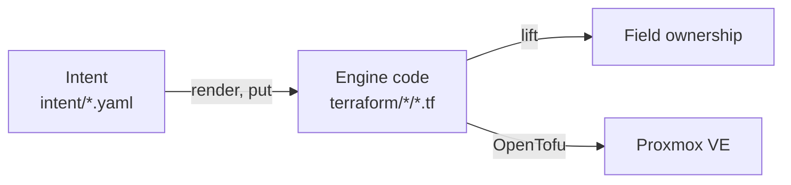

<p align="center">
  
</p>

nodr manages self-hosted infrastructure through intent written in YAML, which
it compiles into standard OpenTofu code in the same Git repository. It is for
homelabs and small and medium-sized businesses that run Proxmox VE. Release
0.1.0 is a command-line tool for Proxmox VE virtual machines; a web GUI that
works on the same intent and code is planned.

## Features

What works today, in release 0.1.0:

- **Intent model and validation.** `nodr/v1alpha1` documents describe
  workspaces, Proxmox clusters, networks, templates, SSH keys and virtual
  machines. `nodr validate` checks their schemas, semantic rules and
  references, finds guest IDs, IPv4 addresses and MAC addresses that are used
  more than once, and reports each problem with its file, line and field.
- **Admission.** `nodr admit` allocates the UID, guest ID, node and IPv4
  addresses of virtual machines and writes them into the intent files, keeping
  comments and formatting. `--dry-run` previews the values.
- **Proxmox VM lens.** The lens maps a `VirtualMachine` to a
  `proxmox_virtual_environment_vm` resource of the `bpg/proxmox` provider and
  back, and property-based tests check the lens laws. `nodr render` prints the
  code that it generates.
- **Structure-preserving updates.** nodr updates the blocks that it manages in
  place and changes only the bytes it has to, so comments, hand formatting,
  expressions, extra attributes and your own code stay as they are.
- **Field ownership.** `nodr describe --ownership` lists the owner of every
  field of a virtual machine, as text or JSON.
- **Plan and apply with OpenTofu.** `nodr plan` compiles intent into the state
  units below `terraform/`, writes the files that change and plans each state
  unit. `nodr apply` applies exactly the saved plans after confirmation, and
  replaces or destroys resources only with `--allow-destroy`.

## Status and roadmap

nodr is at an early stage, and versions stay at 0.x until the API is stable.
Release 0.1.0 delivers part of the first milestone, M0 Foundations. The
[delivery roadmap](docs/design/13-operations-and-delivery.md#138-delivery-roadmap)
plans the rest:

- **M0 Foundations**: the web GUI with Simple Mode forms and an Advanced Mode
  editor, sync of code edits for VMs, change sets and a state service.
- **M1 Clusters and automation**: multi-node clusters, high availability,
  discovery and adoption, drift detection, and a scheduler for backup, update
  and snapshot policies.
- **M2 Networking**: OpenWrt with connectivity-safe apply, IPAM, DHCP, DNS,
  firewall policy and WireGuard.
- **M3 Containers**: Docker hosts, Compose projects, K3s clusters, applications
  and a catalog.
- **M4 Interoperability**: an Ansible engine, importers, export and a plugin
  SDK.
- **M5 SME readiness (1.0)**: a highly available topology, OIDC, RBAC with
  approvals, audit export and remote runners.

## Installation

### From a release

The [releases page](../../releases) has archives for Linux, macOS and Windows
on amd64 and arm64, named `nodr_<version>_<os>_<arch>`, with `darwin` for
macOS. The archives for Windows are `.zip` files, the others `.tar.gz` files.
Download the archive for your platform and `checksums.txt`, verify the archive
and extract `nodr`:

```console
$ sha256sum -c checksums.txt --ignore-missing
nodr_0.1.0_linux_amd64.tar.gz: OK
$ tar -xzf nodr_0.1.0_linux_amd64.tar.gz nodr
$ ./nodr version
```

On macOS, use `shasum -a 256` instead of `sha256sum`. For releases published
while the repository is public,
`gh attestation verify <archive> --repo <owner>/<repo>` also checks the build
provenance.

### From source

Building from source needs Go 1.24 or later. Clone the repository, and in its
root directory run:

```console
$ make build
$ bin/nodr version
```

## Quick start

The [homelab example](examples/homelab/README.md) is a workspace with a
three-node Proxmox VE cluster, three networks, a cloud-image template, an SSH
key and two virtual machines, together with their OpenTofu code. Run these
commands from the root of the repository, with `bin/nodr` from
[a source build](#from-source); with a release archive, use its `nodr` instead.

```console
$ bin/nodr validate -w examples/homelab
8 documents valid
$ bin/nodr admit -w examples/homelab --dry-run
$ bin/nodr render -w examples/homelab vm/web-01
$ bin/nodr describe -w examples/homelab vm/web-01 --ownership
```

None of these commands changes a file or contacts a cluster:

- `validate` checks `nodr.yaml` and every intent document below `intent/`:
  schemas, semantic rules and references between resources.
- `admit --dry-run` prints each value that admission would allocate, such as a
  guest ID or an IPv4 address, without writing it. Both virtual machines in the
  example are admitted already, so it prints nothing.
- `render` prints the OpenTofu code that nodr generates from the intent of
  `web-01`.
- `describe --ownership` shows where `web-01` is defined and managed, and the
  owner of each field. Its managed block in `vms.tf` differs from the rendered
  code in two places: `cores = var.web_cores` is code-owned, and the `smbios`
  block is an extension.

### Plan and apply

`nodr plan` and `nodr apply` need:

- [OpenTofu](https://opentofu.org/) 1.8 or later. nodr runs the program that
  `NODR_TOFU` names, or else `tofu` on `PATH`.
- Credentials for the Proxmox VE API. OpenTofu inherits the environment of
  nodr, so the `bpg/proxmox` provider reads them from variables such as
  `PROXMOX_VE_API_TOKEN`.
- A workspace for your own cluster. The cluster endpoints, the image checksum
  and the SSH key in the example are placeholders.

```console
$ export PROXMOX_VE_API_TOKEN='user@pve!token=secret'
$ bin/nodr plan -w path/to/workspace
$ bin/nodr apply -w path/to/workspace
```

`plan` writes the engine code that changes and prints what each state unit
would add, change, replace and destroy. `apply` plans the same way, asks you to
confirm with `yes`, and applies exactly the saved plans. It refuses plans that
replace or destroy resources unless you pass `--allow-destroy`, even with
`--auto-approve`. `--unit` limits either command to the state units it names,
such as `--unit terraform/pve-main-compute`.

State units without a `backend.tf` keep their OpenTofu state in local files
next to the code; keep those `*.tfstate` files out of Git.

## How it works

A workspace is a directory in Git with a manifest, `nodr.yaml`, intent below
`intent/` and engine code below `terraform/`.



- **Intent** is the desired state in YAML, independent of any tool: a
  `VirtualMachine` names its cluster, template, CPU, memory, disks and
  networks, not the attributes of a provider. Admission writes the values that
  nodr allocates, such as guest IDs and addresses, into intent.
- **A lens** maps one kind of intent to engine code and back. The VM lens
  renders a new managed block for a VM, puts intent values into an existing
  block, and lifts values and their owners out of the code. It edits only the
  bytes it has to.
- **Engine code** is plain OpenTofu code for the `bpg/proxmox` provider, split
  into state units: each directory right below `terraform/` that holds `.tf`
  files, such as `terraform/pve-main-compute/`, is a root module with its own
  state. A `# nodr:managed vm/<name>` comment marks each block that nodr
  manages, and nodr never changes resources without it. You review and commit
  the code like any other change.
- **Field ownership** decides, for each field of a managed block, whether
  intent or code has the last word. nodr derives it from the code:
  - *Synced*: a literal that mirrors intent. nodr writes the intent value into
    it.
  - *Code-owned*: an expression, such as `cores = var.web_cores`, or a literal
    pinned with a `# nodr:keep` comment. nodr leaves it as it is.
  - *Extension*: an attribute that intent does not model, such as the `smbios`
    block in the example. nodr keeps it as it is.

Chapter 4 of the design describes
[field ownership](docs/design/04-dual-mode-and-sync.md#44-field-level-ownership)
and [lenses](docs/design/04-dual-mode-and-sync.md#45-lenses) in full, including
the planned sync of code edits back into intent.

## Documentation

- [Technical design](docs/README.md): the architecture of nodr, from the
  resource model and sync to security and the delivery roadmap.
- [Architecture decision records](docs/adr/README.md): the decisions behind
  the design and the alternatives that were considered.
- [Homelab example](examples/homelab/README.md): the workspace of the quick
  start.
- [Changelog](CHANGELOG.md): the notable changes in each release.

`nodr --help` and `nodr <command> --help` describe each command and its flags.

## Contributing

[CONTRIBUTING.md](CONTRIBUTING.md) covers the development setup, the
repository layout, tests, Git conventions and the release process.

## License

nodr is licensed under the Apache License 2.0; see [LICENSE](LICENSE).
