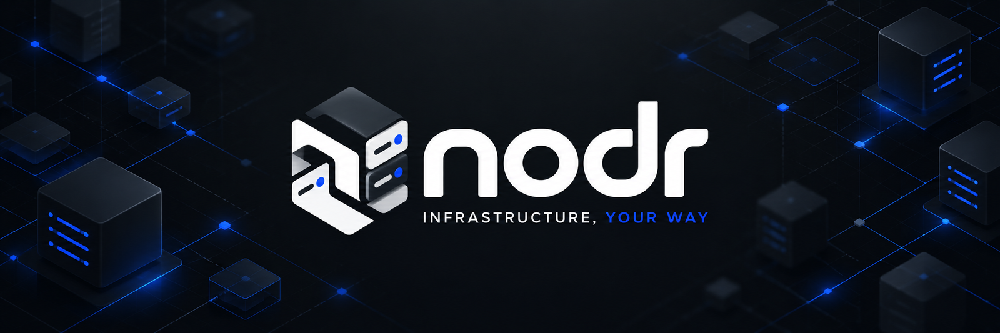
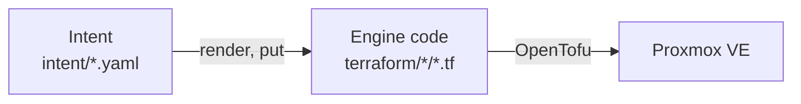

<p align="center">
  
</p>

nodr manages Proxmox VE infrastructure from YAML intent in a Git-backed
workspace. It compiles that intent into ordinary OpenTofu code; use the CLI,
the dashboard, or both against the same workspace.

## Install

### From a release

The [releases page](../../releases) has archives for Linux, macOS and Windows
on amd64 and arm64, named `nodr_<version>_<os>_<arch>` (`darwin` for macOS).
Windows archives are `.zip`; the others are `.tar.gz`. Download the archive for
your platform and `checksums.txt`, verify it, then extract `nodr`:

```console
$ sha256sum -c checksums.txt --ignore-missing
nodr_0.1.0_linux_amd64.tar.gz: OK
$ tar -xzf nodr_0.1.0_linux_amd64.tar.gz nodr
$ ./nodr version
```

On macOS, use `shasum -a 256` instead of `sha256sum`.

### From source

Building needs Go 1.24 or later:

```console
$ make build
$ bin/nodr version
```

The examples below use `bin/nodr`. Substitute `./nodr` when using a release
archive. Every command accepts `-w <workspace>`; without it, nodr finds the
closest directory containing `nodr.yaml`.

## Start with a workspace

A workspace is a Git repository containing a `nodr.yaml` manifest, YAML intent
below `intent/`, and generated OpenTofu code below `terraform/`. Start by
copying or adapting a workspace that matches your infrastructure. The
[homelab example](examples/homelab/README.md) provides a complete, safe-to-read
reference layout:

```text
workspace/
├── nodr.yaml
├── intent/
└── terraform/
```

The example has placeholder endpoints, image checksums, and SSH keys. Do not
plan or apply it against a real cluster until those values describe your own
infrastructure.

## Use the CLI

Use this workflow to inspect and prepare intent before making infrastructure
changes:

```console
$ bin/nodr validate -w examples/homelab
8 documents valid
$ bin/nodr admit -w examples/homelab --dry-run
$ bin/nodr render -w examples/homelab vm/web-01
$ bin/nodr describe -w examples/homelab vm/web-01 --ownership
```

- `validate` checks the manifest, schemas, semantic rules, and references.
- `admit --dry-run` previews allocated values such as guest IDs and addresses
  without writing files. Omit `--dry-run` to write the allocation into intent.
- `render` prints the OpenTofu block generated for a resource.
- `describe --ownership` shows which fields are synced from intent,
  code-owned, or extensions that nodr preserves.

### Connect and inspect a cluster

`cluster connect` needs the same durable base64-encoded 32-byte key in
`NODR_KEK` that later CLI commands use to decrypt the stored API token. Create
and retain the key using the [dashboard key setup](#1-protect-local-credentials),
then export it before connecting, discovering, planning, or applying a
workspace with connected-cluster credentials:

```console
$ export NODR_KEK="$(base64 < path/to/workspace/.nodr/kek | tr -d '\n')"
$ bin/nodr cluster connect -w path/to/workspace
```

`cluster connect` interactively bootstraps least-privilege Proxmox credentials,
pins the server certificate fingerprint, stores the API token locally, and
writes a `ProxmoxCluster` intent document.

After connecting, inspect a cluster's live QEMU guests without changing either
the cluster or intent:

```console
$ bin/nodr cluster discover pve-main -w path/to/workspace
```

`discover` reports guests already managed by nodr, undiscovered guests, and
guests whose tags or description mention another infrastructure-as-code tool.
It is read-only; adopting discovered guests is not implemented.

### Plan and apply

Plan and apply require [OpenTofu](https://opentofu.org/) 1.8 or later. nodr runs
`NODR_TOFU` when set, otherwise `tofu` from `PATH`. For a connected cluster,
export `NODR_KEK` so the CLI can decrypt its stored credentials. For an
existing workspace that does not use `credentialsRef`, provide the provider
credentials through the environment, for example:

```console
$ export PROXMOX_VE_API_TOKEN='user@pve!token=secret'
$ bin/nodr plan -w path/to/workspace
$ bin/nodr apply -w path/to/workspace
```

`plan` updates generated engine code and prints the changes for each state
unit. `apply` creates fresh saved plans, asks for `yes`, then applies those
plans. Replacement and destruction require `--allow-destroy`, including with
`--auto-approve`. Use `--unit terraform/pve-main-compute` to limit either
command to one or more state units.

State units without `backend.tf` retain OpenTofu state locally next to the
code. Keep `*.tfstate` files out of Git.

## Use the dashboard

The dashboard and CLI operate on the same intent, plans, and cluster
connections. Use the dashboard for inventory, VM creation, cluster connection,
discovery, change review, apply, and desired VM power actions; use the CLI when
it better fits your Git or automation workflow.

### 1. Protect local credentials

The dashboard stores encrypted cluster credentials in
`<workspace>/.nodr/secrets.db`. Create one durable 32-byte key-encryption key
(KEK), retain it for as long as that encrypted state exists, and never commit
the key or `.nodr/` directory. This one-time setup creates a raw 32-byte key
with owner-only permissions:

```console
$ install -d -m 700 path/to/workspace/.nodr
$ umask 077; openssl rand 32 > path/to/workspace/.nodr/kek
```

Start the dashboard with that same key file. `--kek-file` is a `server` flag:

```console
$ bin/nodr server -w path/to/workspace --kek-file path/to/workspace/.nodr/kek
```

CLI commands that open encrypted cluster credentials require the same key as
base64-encoded 32 bytes in `NODR_KEK`; the server's `--kek-file` setting is not
shared with other processes:

```console
$ export NODR_KEK="$(base64 < path/to/workspace/.nodr/kek | tr -d '\n')"
```

### 2. Create the local administrator

Create or replace the dashboard's single local administrator. This command
writes the local authentication database; it does not open the encrypted
secrets store. Read the credentials instead of placing a real password in
shell history:

```console
$ read -r -p 'Username: ' NODR_ADMIN_USERNAME
$ read -r -s -p 'Password: ' NODR_ADMIN_PASSWORD; printf '\n'
$ printf '%s\n%s\n' "$NODR_ADMIN_USERNAME" "$NODR_ADMIN_PASSWORD" | \
    bin/nodr auth create-admin --password-stdin -w path/to/workspace
$ unset NODR_ADMIN_USERNAME NODR_ADMIN_PASSWORD
```

### 3. Run nodr and sign in

Start the server, then open `http://127.0.0.1:8080` in a browser. Its default
bind address is loopback-only:

```console
$ bin/nodr server -w path/to/workspace --kek-file path/to/workspace/.nodr/kek
```

Sign in with the local administrator. From **Infrastructure**, create VMs or
connect clusters. Select **Discover** for a connected cluster to see the same
read-only live-guest classification as `nodr cluster discover`. Select
**Changes** to plan, review destructive changes, and apply explicitly.

Pass `--addr` only when you intentionally need another listen address; protect
any non-loopback deployment with appropriate network and TLS controls.

## Features

- **YAML intent and validation** for workspaces, Proxmox clusters, networks,
  templates, SSH keys, and virtual machines.
- **Deterministic admission** of VM IDs, addresses, nodes, and MAC addresses.
- **Structure-preserving OpenTofu projection** that preserves comments,
  formatting, user code, and code-owned fields.
- **Field ownership** reporting for synced fields, code-owned expressions, and
  unmanaged extensions.
- **OpenTofu plan and apply** with explicit destructive-change protection.
- **Authenticated dashboard and API** for the same workspace model as the CLI.

## How it works


```mermaid
flowchart LR
    intent["Intent\nintent/*.yaml"]
    code["Engine code\nterraform/*/*.tf"]
    pve["Proxmox VE"]

    intent -->|"render, put"| code
    code -->|"OpenTofu"| pve
```

Intent is tool-neutral YAML. nodr renders managed OpenTofu blocks and leaves
user-owned blocks untouched. A `# nodr:managed <kind>/<name>` marker identifies
blocks nodr may change; `# nodr:keep` makes a literal code-owned. Generated
OpenTofu remains ordinary code that can run without nodr.

## Status and roadmap

nodr is pre-1.0 and its API can change. The
[delivery roadmap](docs/design/13-operations-and-delivery.md#138-delivery-roadmap)
covers the remaining foundation work and later networking, containers,
interoperability, and SME-readiness milestones. Live discovery is available;
adoption remains planned.

## Documentation

- [Technical design](docs/README.md): architecture, resource model, sync, and
  operations.
- [Architecture decision records](docs/adr/README.md): design decisions and
  alternatives.
- [Homelab example](examples/homelab/README.md): reference workspace.
- [Changelog](CHANGELOG.md): notable released and unreleased changes.

`nodr --help` and `nodr <command> --help` list commands and flags.

## Contributing

[CONTRIBUTING.md](CONTRIBUTING.md) covers development setup, tests, Git
conventions, and releases.

## License

nodr is licensed under the Apache License 2.0; see [LICENSE](LICENSE).
