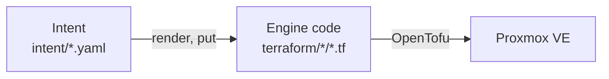

<p align="center">
  
</p>

nodr is a self-hosted browser control plane for Proxmox VE infrastructure. Run
it on a Linux server (amd64 or arm64): people use the browser, while automation
uses the HTTP API. A Git workspace holds declarative intent, and nodr compiles
it into ordinary OpenTofu code.

## Install

Releases are Linux-only (amd64, arm64) tar.gz archives with SHA-256
checksums, produced by CI from `v*.*.*` tags.

**Installer** (installs the latest stable release, verifies its checksum, and
never touches workspaces or secrets). Requires root to write `/usr/local/bin`:

```sh
curl -fsSL https://raw.githubusercontent.com/centopw/nodr/main/scripts/install.sh | sudo sh
```

`sudo` must wrap `sh` — `sudo curl ... | sh` downloads as root but still runs
the installer as your user. Without root, install into your own `PATH`:

```sh
curl -fsSL https://raw.githubusercontent.com/centopw/nodr/main/scripts/install.sh | sh -s -- --prefix "$HOME/.local"
```

To pin an existing release tag, add `--version vX.Y.Z`:

```sh
curl -fsSL https://raw.githubusercontent.com/centopw/nodr/main/scripts/install.sh | sudo sh -s -- --version vX.Y.Z
```

**From a release archive, manually** (replace `vX.Y.Z` with an existing release
tag):

```sh
VERSION=vX.Y.Z
curl -fsSLO "https://github.com/centopw/nodr/releases/download/${VERSION}/nodr_${VERSION#v}_linux_amd64.tar.gz"
curl -fsSLO "https://github.com/centopw/nodr/releases/download/${VERSION}/checksums.txt"
sha256sum -c checksums.txt --ignore-missing    # macOS: shasum -a 256 -c
tar -xzf "nodr_${VERSION#v}_linux_amd64.tar.gz" nodr
./nodr version
```

**Docker:**

```sh
docker run -p 127.0.0.1:8080:8080 -v /srv/nodr/workspace:/workspace \
    -e NODR_KEK="$(openssl rand -base64 32)" \
    ghcr.io/centopw/nodr:latest
```

**Docker Compose** and **Helm** charts live in
[`deploy/compose/`](deploy/compose/docker-compose.yml) and
[`deploy/helm/nodr/`](deploy/helm/nodr); see the
[production guide](docs/guides/production.md).

## First run

nodr serves an existing workspace; it never creates one. Point it at a Git
repository holding `nodr.yaml`, intent under `intent/`, and generated
OpenTofu under `terraform/` — the [homelab example](examples/homelab/README.md)
is a complete reference layout.

1. Export a durable key-encryption key and, for the very first start, a
   one-time bootstrap token:

   ```console
   $ export NODR_KEK="$(openssl rand -base64 32)"
   $ export NODR_BOOTSTRAP_TOKEN=one-time-setup-token
   $ nodr server -w /srv/nodr/workspace
   ```

2. Open `http://127.0.0.1:8080`, complete setup with the bootstrap token,
   and create the administrator. Remove `NODR_BOOTSTRAP_TOKEN` afterwards.
3. Use **Infrastructure** to create VMs or connect clusters, and **Changes**
   to plan and apply.

For advanced local workspace inspection and development commands, see the
[local development guide](docs/guides/local-development.md#advanced-local-tooling).

The server binds loopback by default and speaks plain HTTP — terminate TLS
in a reverse proxy. The [production guide](docs/guides/production.md) covers
systemd, Docker, Compose, Helm, backups, and upgrades in full.

## Features

- **Browser and API over one model** — the dashboard dispatches the same typed
  commands exposed through the HTTP API.
- **YAML intent and validation** for workspaces, Proxmox clusters, networks,
  templates, SSH keys, and virtual machines.
- **Deterministic admission** of VM IDs, addresses, nodes, and MAC addresses.
- **Structure-preserving OpenTofu projection** that preserves comments,
  formatting, user code, and code-owned fields.
- **Field ownership** reporting for synced fields, code-owned expressions,
  and unmanaged extensions.
- **OpenTofu plan and apply** with explicit destructive-change protection.
- **Authenticated dashboard and API** with encrypted cluster credentials
  under `<workspace>/.nodr/`.

## How it works


```mermaid
flowchart LR
    intent["Intent\nintent/*.yaml"]
    code["Engine code\nterraform/*/*.tf"]
    pve["Proxmox VE"]

    intent -->|"render, put"| code
    code -->|"OpenTofu"| pve
```

Intent is tool-neutral YAML. nodr renders managed OpenTofu blocks and leaves
user-owned blocks untouched. A `# nodr:managed <kind>/<name>` marker
identifies blocks nodr may change; `# nodr:keep` makes a literal code-owned.
Generated OpenTofu remains ordinary code that runs without nodr.

## Status and roadmap

nodr is pre-1.0 and its API can change. A hosted multi-node topology
(control plane plus runner, GitHub App integration, webhooks) is designed in
[ADR-0010](docs/adr/0010-web-only-vps-control-plane.md) and
[the delivery roadmap](docs/design/13-operations-and-delivery.md#138-delivery-roadmap)
but is **not shipped**; this README describes the single-binary workspace
server only.

## Documentation

- [Local development](docs/guides/local-development.md): build, run, and test
  from a checkout.
- [Production](docs/guides/production.md): installer, systemd, Docker,
  Compose, Helm, backups, upgrades.
- [Technical design](docs/README.md): architecture, resource model, sync, and
  operations.
- [Architecture decision records](docs/adr/README.md): design decisions and
  alternatives.
- [Homelab example](examples/homelab/README.md): reference workspace.
- [Changelog](CHANGELOG.md): notable released and unreleased changes.

`nodr --help` and `nodr <command> --help` list commands and flags.

## Contributing

[CONTRIBUTING.md](CONTRIBUTING.md) covers development setup, tests, Git
conventions, and releases.

## License

nodr is licensed under the Apache License 2.0; see [LICENSE](LICENSE).