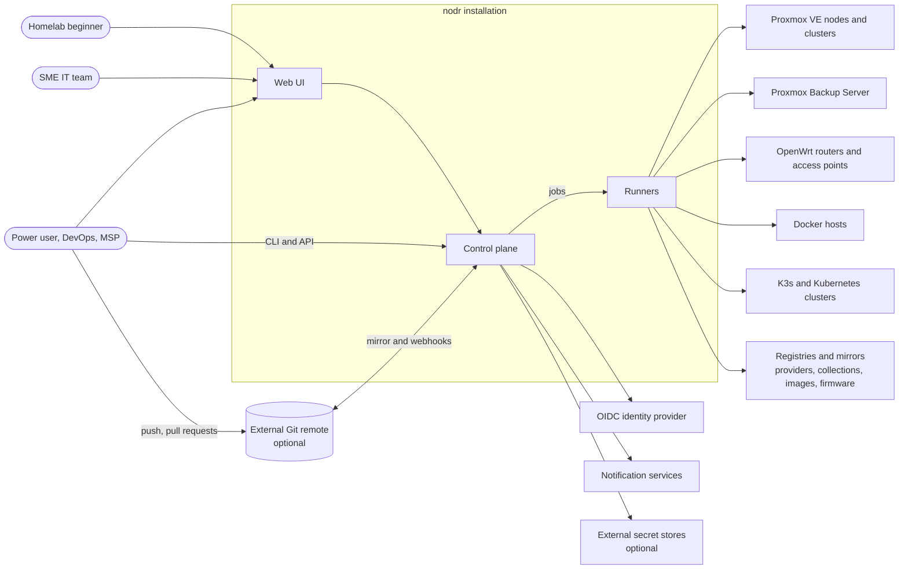
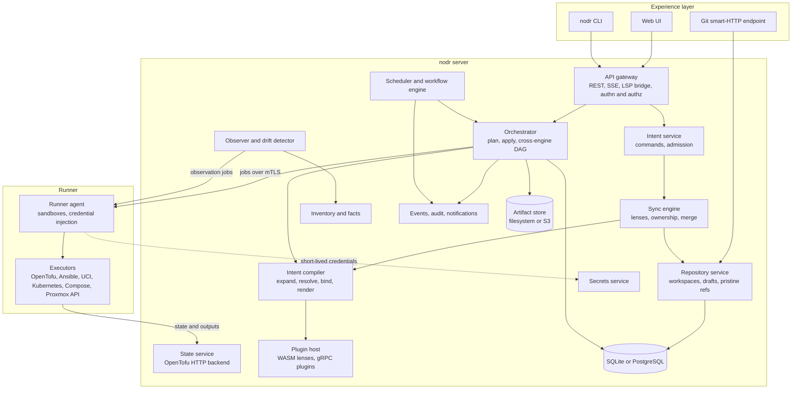
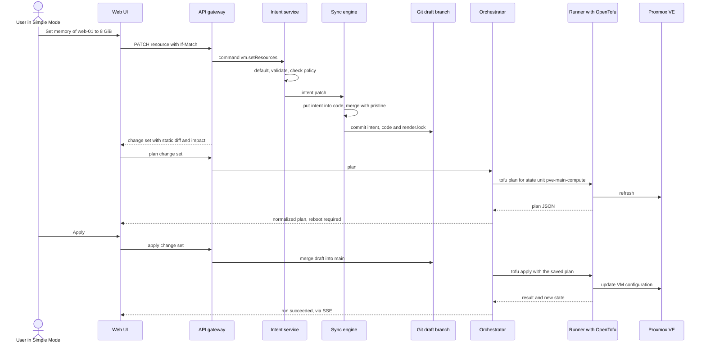
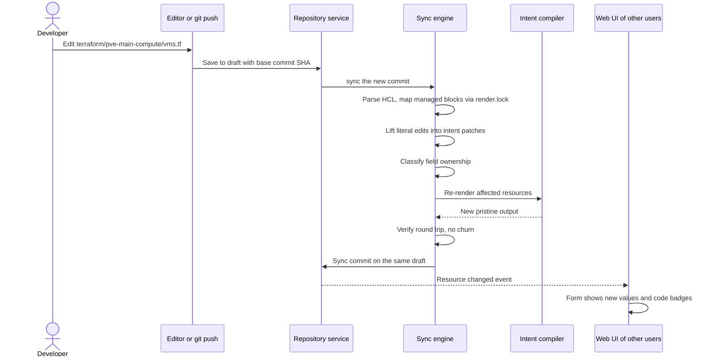

# 2. System Architecture

> Part of the [nodr technical design](../README.md).

## 2.1 Architectural overview

nodr is a control plane that keeps desired state in Git, compiles it into
standard engine code and executes that code through isolated runners. It is
organized in four layers:

| Layer | Responsibility | Main components |
| ----- | -------------- | --------------- |
| **Experience** | How people and tools interact with nodr | Web UI (Simple and Advanced Mode), CLI, REST API, Git endpoint |
| **Model** | What the infrastructure should look like | Intent service, sync engine, intent compiler, repository service |
| **Execution** | Making reality match the model, now or on a schedule | Orchestrator, scheduler and workflow engine, runners and executors |
| **Knowledge** | What reality looks like and what happened | State service, inventory, observer and drift detector, secrets, audit and events |

The model layer is the heart of the design. The GUI and the code editor are two
editors for the same model, and the sync engine keeps the model's two
representations, intent documents and engine code, consistent
([§4](04-dual-mode-and-sync.md)).

## 2.2 System context

External systems and how nodr talks to them:

| System | Protocol | Purpose |
| ------ | -------- | ------- |
| Proxmox VE | HTTPS API with API tokens, SSH for host-level tasks | Guests, storage, HA, cluster options, backups, host updates |
| Proxmox Backup Server | HTTPS API | Datastores, retention, verification, restore tests |
| OpenWrt | ubus JSON-RPC over HTTPS (rpcd), SSH as fallback | UCI configuration, apply with rollback, backups, firmware |
| Docker hosts | SSH (Docker CLI and Compose over an SSH context) | Engine configuration, Compose projects, images, volumes |
| Kubernetes and K3s | Kubernetes API with kubeconfig, SSH for node setup | Cluster lifecycle, workloads, GitOps bootstrap |
| Git remote | HTTPS or SSH, webhooks | Mirroring, pull-request checks, external editing |
| Identity provider | OpenID Connect | Single sign-on and group mapping |
| Notification services | SMTP, HTTP APIs | Alerts, run reports, approval requests |
| Registries and mirrors | HTTPS | OpenTofu providers, Ansible collections, container images, OpenWrt firmware (Attended Sysupgrade) |

## 2.3 Components

| Component | Responsibility | Notes |
| --------- | -------------- | ----- |
| **Web UI** | Single-page app for Simple Mode, Advanced Mode and the split code view | Uses only the public API ([§11](11-api-and-cli.md)) |
| **API gateway** | REST and SSE endpoints, the WebSocket bridge to language servers, authentication, authorization, rate limiting | Stateless, horizontally scalable |
| **Intent service** | Turns commands into intent patches, runs admission: defaulting, allocation, validation, policy | Every GUI action is a typed command ([§5.2](05-compiler-and-engines.md#52-commands-gui-actions-as-data)) |
| **Sync engine** | Keeps intent and code consistent: lifts code edits into intent, merges regenerated code into edited code, tracks field ownership | The core of the dual-mode design ([§4](04-dual-mode-and-sync.md)) |
| **Intent compiler** | Expands blueprints, resolves references, allocates, binds aspects to engines, renders engine code | Pure and deterministic, so it is testable and cacheable |
| **Repository service** | Hosts workspace repositories, draft branches and pristine refs; mirrors to external remotes; serves Git over smart HTTP | Ref updates are compare-and-swap |
| **Orchestrator** | Builds cross-engine execution graphs, runs plans and applies, aggregates normalized plans, handles locks and approvals | Applies exactly the reviewed plan |
| **Scheduler and workflow engine** | Stores schedules, fires triggers, runs durable multi-step workflows, enforces maintenance windows and concurrency | [§7](07-scheduler.md) |
| **Observer and drift detector** | Reads actual state from managed systems, updates inventory, detects and classifies drift | Cheap digest polling plus periodic deep scans |
| **State service** | Implements the OpenTofu/Terraform HTTP state backend with locking, versioning and encryption; stores engine outputs | One state per state unit |
| **Inventory and facts** | Graph of discovered and managed objects, platform facts (versions, capabilities), topology | Feeds validation, placement and the UI |
| **Secrets service** | Envelope-encrypted secret storage, external store adapters, short-lived credential minting | [§10.5](10-security.md#105-secrets-management) |
| **Events, audit, notifications** | Internal event bus with transactional outbox, append-only audit log, notification routing, outbound webhooks | CloudEvents format |
| **Plugin host** | Loads plugins: WebAssembly lenses in-process, gRPC executors and observers in runners | [§5.8](05-compiler-and-engines.md#58-plugin-architecture) |
| **Runner** | Pulls jobs, prepares a sandbox with the pinned toolchain, injects scoped credentials, streams events and logs | Embedded by default, remote for other sites |

## 2.4 Key flows

### 2.4.1 GUI change to applied infrastructure

The preview comes in two stages. The **static diff** (intent and code
changes plus the impact the schemas predict) is computed locally in well under
a second. The **engine plan** runs asynchronously and replaces the prediction
with the engine's own answer.

### 2.4.2 Code change from the editor or Git

### 2.4.3 Scheduled automation

The scheduler fires a schedule, creates a run of the referenced workflow, and
executes its steps through the orchestrator and runners. Steps that change
desired state, such as bumping a K3s version, go through the same change-set
path as a GUI edit, so automation leaves the same audit trail as people do.
Details are in [§7](07-scheduler.md).

### 2.4.4 Observation and drift

Observers poll cheap change indicators (for example the configuration
`digest` that the Proxmox API returns for every guest) and run deep scans
periodically and before every apply. A difference between the last applied
revision and reality becomes a drift report with *revert*, *adopt* and
*ignore* actions ([§4.10](04-dual-mode-and-sync.md#410-infrastructure-drift)).

## 2.5 Data architecture

| Data | Store | Authoritative | Rebuildable from | Notes |
| ---- | ----- | ------------- | ---------------- | ----- |
| Intent, engine code, schedules, policies, allocations | Workspace Git repository | Yes | Git mirror or backup | Never contains plaintext secrets |
| Pristine render output | Hidden refs `refs/nodr/pristine/*` | No | Re-rendering the same revision | Merge base for regeneration |
| Engine state (OpenTofu) | State service, stored in DB or artifact store | Yes, for the engine | Refresh and import as a last resort | Versioned, locked, encrypted |
| Runs, steps, plans, logs | DB and artifact store | Yes, for history | Not rebuildable | Retention policy per workspace |
| Scheduler runtime (next fire times, leases, queue) | DB | Operational | Git (definitions) | Recomputed on startup |
| Inventory, facts, drift reports | DB | No | Re-observation | Cache of reality |
| Secrets | DB with envelope encryption, or external store | Yes | Backup plus key escrow | [§10.5](10-security.md#105-secrets-management) |
| Users, roles, tokens, audit log | DB | Yes | Not rebuildable | Audit log is hash-chained |

Consistency rules ([ADR-0001](../adr/0001-use-git-as-the-desired-state-ledger.md)):

1. **Git ref updates are the linearization point** for desired state. A change
   exists once the ref update succeeds. Ref updates use compare-and-swap, so
   two writers can never both win.
2. The DB indexes Git content through a **transactional outbox**. Consumers are
   idempotent, and `nodr admin reindex` rebuilds every index from Git.
3. Every run records the **commit SHA** it planned and applied. Each state unit
   has a *live revision* pointer to the last successfully applied commit, which
   drives the "pending changes" and drift views.
4. Losing the database loses history and operational data, never desired state.

## 2.6 Process model and deployment topologies

nodr ships as one binary with two modes:

- `nodr server` runs the API, sync, orchestrator, scheduler and observer
  roles. Roles can be enabled selectively. Singleton duties (the schedule
  ticker and observer coordination) use a lease in the database for leader
  election.
- `nodr runner` executes jobs. It connects outbound to the server over gRPC on
  HTTP/2 with mutual TLS, pulls jobs, and runs each job in a sandbox. The
  server embeds a runner by default.

### Topology A: all-in-one (homelab)

One container, LXC container or small VM running the server with an embedded
runner, SQLite and local Git storage. An optional mirror pushes the workspace
repository to an external remote. Sizing: 1 vCPU, 1 GiB RAM, 10 GiB disk.

### Topology B: highly available (SME)

Two or three server replicas behind a reverse proxy, PostgreSQL, S3-compatible
object storage for artifacts and at least two runners. In this topology the
authoritative workspace repositories live on a Git server (Forgejo, Gitea or
GitLab). Replicas keep local clones and update refs with atomic, lease-checked
pushes, so Git's own semantics provide optimistic concurrency between replicas.

### Topology C: multi-site

Topology A or B plus remote runners at each site. Runners carry a `site`
label, and jobs are routed to a runner that can reach the target. Remote sites
only need outbound HTTPS to the control plane, which suits homelabs behind NAT
and branch offices.

### Running nodr on the infrastructure it manages

nodr may run as a guest on the Proxmox cluster it manages. It then detects its
own guest and host and protects them:

- Destructive operations on nodr's own guest need break-glass confirmation.
- Rolling workflows migrate nodr's guest first and handle its host last.
- Network changes on the path between nodr and a device always use
  connectivity-safe apply ([§8.4](08-networking.md#84-openwrt-integration)).
- The installer recommends a small external device for two-node clusters, so
  that nodr can also host the corosync QDevice.

## 2.7 Technology stack

| Concern | Choice | Rationale |
| ------- | ------ | --------- |
| Control plane language | Go | Single static binary for amd64 and arm64; native HCL libraries (`hcl/v2`, `hclwrite`) for edits that preserve comments and formatting; Kubernetes `client-go` and the Helm SDK; strong concurrency. See [ADR-0007](../adr/0007-go-single-binary-control-plane.md). |
| Web UI | TypeScript, React, Vite | Mature ecosystem for schema-driven forms, data grids and graph views |
| Code editor | Monaco with `monaco-languageclient` | The editor core of VS Code; speaks the Language Server Protocol over WebSocket |
| Language servers | terraform-ls (or an OpenTofu-compatible fork), yaml-language-server with nodr schemas, the Ansible language server | Completion, hover docs and diagnostics in the browser |
| Database | SQLite in WAL mode by default; PostgreSQL 15 or later for HA | Zero-ops for homelabs, a proven path to HA for SMEs |
| Git | go-git for in-process reads; the bundled `git` binary for merges, maintenance and smart HTTP | go-git has no full three-way merge; the CLI is the reference implementation |
| Validation | JSON Schema 2020-12 plus CEL (`cel-go`) | Declarative schemas drive forms and editor completion; CEL expresses cross-field rules |
| Terraform-compatible engine | OpenTofu bundled; Terraform CLI optional | Open-source license suitable for bundling; generated HCL works with both. See [ADR-0004](../adr/0004-opentofu-as-default-terraform-compatible-engine.md). |
| Configuration management | `ansible-core` driven by `ansible-runner` | Structured job events for live progress, check and diff mode for plans |
| Kubernetes | `client-go` server-side apply, Helm SDK, optional Flux bootstrap | Field managers and three-way diffs are native to the Kubernetes API |
| Plugins | WebAssembly (wazero) for lenses; gRPC plugins for executors and observers | Lenses stay pure and sandboxed; executors are isolated processes |
| Job queue and workflows | Durable, database-backed queue (`FOR UPDATE SKIP LOCKED` on PostgreSQL, a single-writer queue on SQLite) | No extra infrastructure to run |
| Events | In-process bus, transactional outbox, PostgreSQL `LISTEN/NOTIFY` across replicas | Consistent with the database choice |
| Observability | OpenTelemetry traces, Prometheus metrics, structured JSON logs | Fits common homelab and SME monitoring stacks |
| Packaging | Multi-arch OCI images, a Proxmox LXC appliance, a Helm chart | The three most common ways users run services |

## 2.8 Cross-cutting concerns

- **Concurrency control.** Optimistic concurrency everywhere a person edits:
  ETags on API resources, base commit SHAs on editor saves, compare-and-swap on
  refs. Pessimistic locks only where engines need them: one lock per state
  unit during plan and apply, and hierarchical resource locks for operations
  and workflows ([§7.7](07-scheduler.md#77-execution-engine)).
- **Idempotency.** Mutating API calls accept an `Idempotency-Key`. Workflow
  steps and executors are idempotent or guarded, so a retry never repeats a
  side effect.
- **Error taxonomy.** Engine errors are mapped to *transient* (retried with
  backoff), *conflict* (re-plan needed), *invalid* (user action needed) and
  *fatal* (stop and alert). Each mapped error carries a remediation hint.
- **Determinism.** Rendering depends only on intent, platform facts and
  pinned renderer versions: no timestamps, random values or map iteration
  order in output.
- **Extensibility.** Kinds, lenses, executors, observers, operations and
  workflow steps are all plugin contributions. The built-in integrations use
  the same plugin interfaces as third-party ones.
- **Security.** Covered in [§10](10-security.md).

## 2.9 Scalability envelope

| Dimension | Homelab target | SME target | Technique |
| --------- | -------------- | ---------- | --------- |
| Proxmox nodes | 1 to 5 | Up to 32 per cluster, several clusters | Cluster-scoped state units |
| Guests (VMs and LXC) | Up to 200 | Up to 2,000 | State units partitioned by cluster and environment; incremental rendering |
| OpenWrt devices | Up to 10 | Up to 50 | One UCI unit per device, applied in dependency order |
| Kubernetes clusters | Up to 5 | Up to 20 | Per-cluster units |
| Schedules | Up to 100 | Up to 1,000 | Database-backed timer wheel |
| Concurrent UI users | 1 to 3 | Up to 50 | Stateless API replicas |
| GUI edit to static diff | Under 1 s | Under 1 s | Incremental compile, content-hash caching |
| Render of a 1,000-resource workspace | Under 2 s | Under 2 s | Parallel lens execution |
