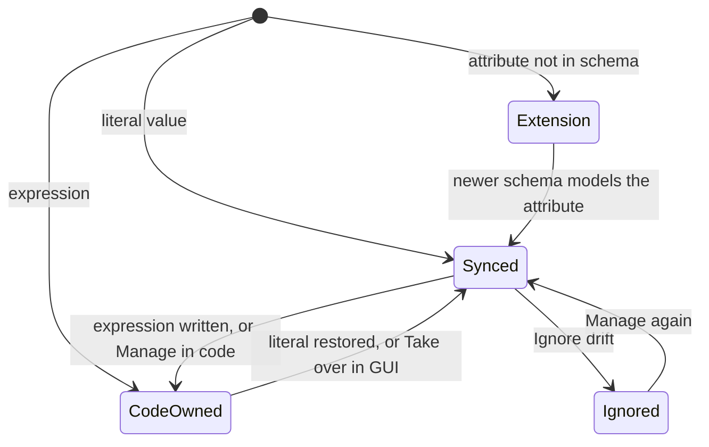
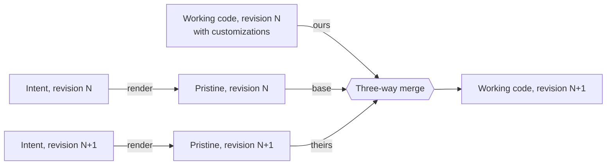

# 4. Dual-Mode Management and Synchronization

> Part of the [nodr technical design](../README.md).

This chapter describes how nodr lets people manage the same infrastructure
through a GUI and through code at the same time, and how it keeps the two
consistent without silently overwriting anyone's work.

## 4.1 Management modes

| Mode | Audience | What it offers |
| ---- | -------- | -------------- |
| **Simple Mode** | Beginners, IT generalists, quick tasks | Dashboards, wizards, forms with `basic` and `standard` fields, plain-language plans, one-click policies. Code stays out of sight, but every object has a "View code" link. |
| **Advanced Mode** | Power users, DevOps engineers | Every field tier, the in-browser IDE, raw intent YAML, custom code, bindings, policies, the API explorer. |
| **Split view** | Anyone learning or reviewing | A form next to the code it generates, updating live, with two-way highlighting: focusing a field highlights its code, and moving the cursor in code highlights the matching field. |

Modes are a presentation preference, not a permission. Permissions such as
`intent:write` and `code:write` decide what a user may change
([§10.4](10-security.md#104-authorization)). A beginner in Simple Mode and a
developer in Advanced Mode can edit the same resource at the same time, and the
rules in this chapter keep their work consistent.

## 4.2 Advanced Mode in the browser

Advanced Mode is a lightweight IDE for the workspace repository:

- **File tree with ownership badges.** Each file shows whether it is managed,
  managed with customizations, or user-owned.
- **Editor with language intelligence.** Monaco with language servers over
  WebSocket: terraform-ls for HCL, yaml-language-server with nodr, Compose and
  Kubernetes schemas, the Ansible language server, and a nodr grammar and
  checker for UCI files. Language servers run in per-session sandboxes on a
  runner.
- **Ownership decorations.** A CodeLens above each managed block ("Managed by
  nodr · vm/web-01 · 2 customizations · Open in GUI") and gutter markers that
  show whether each attribute is synced, code-owned or an extension.
- **Diagnostics as you type and on save.** Syntax, schema, `tofu validate`,
  `ansible-lint`, policy rules and secret scanning.
- **Review panes.** "My customizations" (working code compared with pristine
  output), "What will change" (compared with `main`), the engine plan, run logs,
  Git history and blame.
- **Drafts.** Saving commits to the current change-set branch. Applying a
  change set squash-merges it into `main` as one commit with a structured
  message. Draft branches are kept for audit for a configurable period.
- **Formatting.** `tofu fmt` for HCL and canonical formatting for YAML and UCI
  on save.

There is no interactive shell in the browser. Commands run as audited actions
(validate, plan, apply) in runner sandboxes ([§10.7](10-security.md#107-runner-isolation-and-code-execution)).

People who prefer their own editor clone the workspace over Git. The `nodr`
CLI runs the same sync and validation locally (`nodr sync --local`,
`nodr validate`), and every push goes through the same pipeline as an edit in
the browser, including the engine plan.

## 4.3 The synchronization problem

nodr has three representations of the same infrastructure:

- **Intent (I):** NRM documents, the GUI's native format.
- **Code (C):** engine code, the power user's native format.
- **Reality (R):** what actually runs.

They can diverge in three ways:

| Divergence | Example | Handled in |
| ---------- | ------- | ---------- |
| Representation drift, I versus C | A developer edits the generated HCL | [§4.4](#44-field-level-ownership) to [§4.9](#49-worked-example) |
| Infrastructure drift, applied state versus R | Someone changes memory in the Proxmox UI | [§4.10](#410-infrastructure-drift) |
| Concurrent edits | A GUI user and a developer change the same VM in different drafts | [§4.8](#48-conflict-handling) |

Simpler approaches fail in predictable ways:

| Approach | Why it fails |
| -------- | ------------ |
| One-way generation (GUI writes code, code edits are overwritten) | Power users lose their work, so they eject and the GUI becomes useless. |
| Code as the only truth, GUI parses the code | Forms cannot edit variables, loops or modules. Resources that span several engines must be stitched together from many files. |
| Two stores synchronized by timestamp | Last writer wins, which means silent data loss. |

nodr keeps both representations in Git and uses a precise rule to decide who
owns each individual value.

## 4.4 Field-level ownership

Every field of every managed resource is in exactly one of four states:

| State | Where the value lives | In the GUI | In code | On infrastructure drift |
| ----- | --------------------- | ---------- | ------- | ----------------------- |
| **Synced** (default) | Intent, mirrored as a literal in code | Editable | Editable; literal edits are lifted into intent | Reported |
| **Code-owned** | Code: an expression, a reference or a pinned literal | Read-only with the value from the last plan and an "Edit in code" action | Editable | Reported |
| **Extension** | Code only; the schema does not model the attribute | Listed read-only under "Code extensions" | Editable | Reported |
| **Ignored** | Nowhere; excluded from management | Shows the observed value and a "Manage again" action | Rendered as an engine ignore rule | Not reported |

Code without a provenance marker is **user-owned**: custom modules, roles,
extra resources or helper files. nodr runs user-owned code, lists what it
defines, and never rewrites it. If user-owned code defines something nodr
understands, such as a `proxmox_virtual_environment_vm`, the GUI offers an
*Adopt* action that turns it into a managed resource.

### How ownership is determined

Ownership is derived from the code on every sync, so there is no separate
ownership file to keep up to date:

1. An attribute the lens does not map is an **extension**.
2. An attribute whose value is a literal the lens can invert is **synced**,
   unless it is pinned.
3. Anything else is **code-owned**: variables, locals, function calls,
   conditionals, dynamic blocks, and any managed block that gains `count` or
   `for_each`.

Two explicit controls exist:

- **Pinning.** A trailing `# nodr:keep` comment marks a literal as code-owned.
  The GUI's "Manage in code" action writes this comment; "Take over" removes
  it.
- **Ignoring.** Ignore rules are part of intent
  (`spec.lifecycle.ignoreDrift: [<field paths>]`). They are rendered as
  `lifecycle { ignore_changes = [...] }` for OpenTofu and as observer filters
  for other engines. Ignore rules written directly in code are lifted like any
  other attribute.



The model borrows from Kubernetes server-side apply, which records a manager
for every field and reports a conflict when a second manager tries to change
it. nodr applies the same idea across the boundary between GUI and code
([ADR-0003](../adr/0003-field-level-ownership-for-gui-and-code-sync.md)).

## 4.5 Lenses

A **lens** is the bidirectional mapping between intent and code for one kind,
aspect and engine. It has three functions:

| Function | Signature | Behavior |
| -------- | --------- | -------- |
| `render` | intent → code | Creates a new managed block in canonical form. |
| `put` | intent × code → code | Writes synced values into existing code and changes nothing else. Comments, formatting, ordering, extensions and code-owned values stay byte-for-byte identical. |
| `lift` | code → values × ownership | Reads synced values back and classifies every attribute. |

### Laws

Lenses must satisfy the well-behavedness laws from the research on
bidirectional transformations (Foster et al., *Combinators for Bidirectional
Tree Transformations*, 2007):

1. **Stability (GetPut):** `put(lift(c), c) = c`. Writing back what was read
   changes nothing, so opening and saving a file never produces a diff.
2. **Fidelity (PutGet):** `lift(put(i, c)) = i` on synced fields. After the
   GUI writes a value, reading the code yields exactly that value.
3. **Creation consistency:** `lift(render(i)) = i`, and every field of freshly
   rendered code is synced.

The laws are checked in two places. Property-based tests in the plugin
conformance kit generate random intents and random code mutations
([§13.7](13-operations-and-delivery.md#137-testing-strategy)). At runtime, every
sync verifies the round trip for the blocks it touched. If a runtime check
fails, typically because of a lens bug or unusual code, the sync engine falls
back conservatively: the affected fields become code-owned, the user is told
why, and a diagnostic bundle is prepared. Nothing is overwritten.

### Mapping example

Most lenses are declarative mapping tables compiled to WebAssembly. Complex
mappings are written as code behind the same interface. An excerpt of the
`VirtualMachine/provision` lens for OpenTofu:

| Intent path | HCL attribute (`bpg/proxmox`) | Conversion | Notes |
| ----------- | ----------------------------- | ---------- | ----- |
| `spec.resources.cpu.cores` | `cpu.cores` | Identity | |
| `spec.resources.memory.size` | `memory.dedicated` | Bytes to MiB | Exact or rejected at admission |
| `spec.resources.memory.minimum` | `memory.floating` | Bytes to MiB; absent is `0` | `0` disables ballooning |
| `spec.nics[i].network` | `network_device[i].bridge`, `network_device[i].vlan_id` | Network to bridge and VLAN, using platform facts | Lift is the inverse lookup; admission rejects networks that would be ambiguous |
| `spec.lifecycle.powerState` | `started` | `running` is `true`, `stopped` is `false`, `unmanaged` omits the attribute and ignores it | See [§6.7](06-proxmox.md#67-vm-and-container-lifecycle) |
| `spec.placement.assignedNode` | `node_name` | Identity | Allocated by placement; a runtime field for HA guests with `node: auto` |

### Structure-preserving editing

`put` never regenerates a whole file. It edits the concrete syntax tree:

| Format | Library or technique |
| ------ | -------------------- |
| HCL | `hclwrite`, which edits at token level and keeps comments and formatting |
| YAML (intent, Ansible, Kubernetes, Compose) | The `yaml.v3` node API, which keeps comments, anchors and key order |
| UCI | A nodr concrete syntax tree that keeps comments and section order |

## 4.6 Provenance and three-way regeneration

### Provenance

Each managed block starts with a marker comment:

```hcl
# nodr:managed vm/web-01
resource "proxmox_virtual_environment_vm" "web_01" {
  # ...
}
```

and has an entry in `.nodr/render.lock`:

```yaml
blocks:
  - uid: 01J9Z3K4T7M2Q8V5X6N0B1C2D3
    ref: vm/web-01
    aspect: provision
    engine: opentofu
    file: terraform/pve-main-compute/vms.tf
    address: proxmox_virtual_environment_vm.web_01
    renderer: proxmox@0.9.2
    pristineHash: sha256:4f1c9a...
```

The marker keeps blocks recognizable in any editor and travels with the block
when it moves between files. The lock gives the exact mapping and detects edits
through hashes. When the two disagree, for example because someone moved a
block by hand, the `uid` settles it. When a resource is renamed, nodr keeps the
`uid`, changes the address and renders a `moved` block so the engine does not
destroy and recreate anything.

### Pristine refs

`refs/nodr/pristine/<branch>` is a parallel history. For every commit on the
branch it holds a commit with the pure renderer output for that revision,
without any user edits, linked to its source commit through a Git note.
Pristine output is the merge base for regeneration.

### Regeneration is a three-way merge



When intent changes or a renderer is upgraded, nodr renders the new pristine
output and merges the difference between old and new pristine output into the
working code. Customizations survive because they are not part of that
difference. Code generators with upgrade support use the same technique, for
example Copier's template updates and JHipster's upgrade branch.

Merges use format-aware drivers that match blocks by type and labels,
attributes by name, YAML list items by identity keys such as `name`, and UCI
sections by name. Plain `diff3` is the fallback. The drivers ship in the `nodr`
CLI and are declared in `.gitattributes`, so a developer merging branches
locally gets the same result as nodr:

```gitattributes
terraform/**/*.tf  merge=nodr-hcl
ansible/**/*.yml   merge=nodr-yaml
openwrt/**         merge=nodr-uci
```

```ini
# Added to the local Git config by `nodr clone` or `nodr init`
[merge "nodr-hcl"]
    name = nodr structural HCL merge
    driver = nodr merge-driver hcl %O %A %B %P
```

Without the drivers Git falls back to line merges, which work in the common
case, and the next sync verifies the result either way.

## 4.7 Sync pipeline

Sync runs on every change, whatever its source: a GUI or API command, an
editor save, a push to nodr's Git endpoint, or a new commit on an external
remote (webhook or polling).

```text
sync(draft, commit C):
  changedIntent, changedCode := diff(parent(C), C)

  # 1. Code to intent
  for each changed file f in changedCode:
      tree := parse(f)                      # syntax errors keep the draft unappliable
      for each managed block b in tree:
          r := resolve(b)                   # marker, render.lock, uid
          values, ownership := lens(r, b).lift(b)
          patch := diff(syncedFields(intent[r]), values)
          if patch and changedIntent set the same field to different values:
              recordConflict(r, field)      # see 4.8
          else:
              intent[r] := apply(intent[r], patch)
      mark new blocks without provenance as user-owned
      mark removed managed blocks as pending deletions

  # 2. Intent to code
  admitted := admission(intent)             # defaults, allocations, validation, policy
  newPristine := render(admitted)           # pure and deterministic
  code := merge3(base: pristine(parent(C)), ours: code, theirs: newPristine)

  # 3. Verify
  check stability and fidelity for every touched block
  on failure: demote the affected fields to code-owned and report

  # 4. Record
  commit changed intent, code and render.lock as a sync commit on the draft
  set refs/nodr/pristine/<draft> to newPristine
```

Properties:

- **Idempotent.** Syncing a commit that sync produced changes nothing.
- **Offline.** Sync reads platform facts from the inventory but never talks to
  infrastructure, so it can run anywhere, including on a laptop.
- **Attributed.** A sync commit names the person whose change triggered it as
  author and nodr as committer.

### Deleting a managed block

Removing a managed block from code is ambiguous: the user may want to delete
the resource or only stop managing it. The editor asks: *delete the resource*,
*stop managing it and keep the infrastructure*, or *restore the block*. Pushes
to the protected `main` branch of the nodr Git endpoint are rejected with an
explanation:

```text
remote: nodr: managed block vm/web-01 was removed from terraform/pve-main-compute/vms.tf
remote:   To delete the VM, also delete intent/compute/web-01.yaml.
remote:   To stop managing it and keep the VM, run: nodr forget vm/web-01
```

Pushes to draft branches are accepted, but the change set cannot be applied
until the question is answered.

## 4.8 Conflict handling

| # | Situation | Behavior |
| - | --------- | -------- |
| 1 | GUI edits a synced field | Intent is updated and the literal in code is updated in place. |
| 2 | Code changes a synced field to another literal | The value is lifted and the GUI shows it. |
| 3 | Code replaces a synced literal with an expression | The field becomes code-owned. The GUI shows the value from the last plan, read-only. |
| 4 | GUI tries to edit a code-owned field | Blocked, with two choices: *Edit in code* opens the editor at the expression; *Take over* replaces the expression with a literal after showing the code diff and asking for confirmation. |
| 5 | Code adds an attribute the schema does not model | It becomes an extension, is preserved across regeneration and is listed in the GUI. |
| 6 | Code removes a managed block | nodr asks what was meant ([§4.7](#47-sync-pipeline)). |
| 7 | Code adds a new block without provenance | It is user-owned. nodr lists it and offers *Adopt* if it recognizes the resource type. |
| 8 | Two drafts set the same synced field to different values | The second merge reports a field-level conflict and shows both values side by side. |
| 9 | A draft is based on an outdated `main` | Applying rebases it semantically. If the plan changes as a result, a new review is required. |
| 10 | A renderer upgrade changes generated code | nodr creates a migration change set that must pass the zero-diff gate ([§13.4](13-operations-and-delivery.md#134-upgrades)). |
| 11 | A newer schema models an attribute that was an extension | The value is lifted into intent and becomes synced. The change set says so. |
| 12 | An external push leaves the workspace inconsistent (invalid HCL, broken references) | The nodr endpoint rejects it. For an external remote, nodr marks the commit "sync failed", reports a commit status and opens a draft that fixes it. |

Conflicts are resolved field by field: the resolution view shows the code
value (for example `var.web_cores`) next to the GUI value (`4`) and lets the
user pick one or type a new value. Text conflicts in user-owned code use a
standard three-pane merge editor.

## 4.9 Worked example

This example follows one VM, `web-01`, through a sequence of edits.

**Step 1: created in the GUI.** The wizard produces the intent from
[§3.13](03-resource-model.md#313-examples) and this managed block (excerpt):

```hcl
# nodr:managed vm/web-01
resource "proxmox_virtual_environment_vm" "web_01" {
  name      = "web-01"
  node_name = "pve2"
  vm_id     = 1012
  tags      = ["app-website", "env-prod", "nodr"]

  cpu {
    cores = 2
    type  = "x86-64-v2-AES"
  }

  memory {
    dedicated = 4096
    floating  = 2048
  }
}
```

All fields are synced.

**Step 2: memory changed in the GUI.** Only the one literal changes:

```diff
   memory {
-    dedicated = 4096
+    dedicated = 8192
     floating  = 2048
   }
```

**Step 3: a developer edits the code.** They disable ballooning and add SMBIOS
data that a licensed application checks. The v1 VM schema does not model
SMBIOS:

```diff
   memory {
     dedicated = 8192
-    floating  = 2048
+    floating  = 0
   }
+
+  # The vendor license is bound to this serial number
+  smbios {
+    serial = "LIC-2231-7781"
+  }
```

Sync lifts `floating = 0`, so the GUI now shows ballooning as disabled. The
`smbios` block becomes an extension and appears under "Code extensions" in the
GUI.

**Step 4: the developer makes the core count configurable.** They declare
`variable "web_cores"` in their own file `terraform/pve-main-compute/custom.tf`,
which is user-owned, and reference it:

```diff
   cpu {
-    cores = 2
+    cores = var.web_cores
     type  = "x86-64-v2-AES"
   }
```

The field becomes code-owned. The GUI shows "2, managed in code
(`var.web_cores`)" as read-only.

**Step 5: a GUI user wants 4 cores.** The field is locked, so they choose
*Take over*. nodr shows the code diff, asks for confirmation and writes:

```diff
   cpu {
-    cores = var.web_cores
+    cores = 4
     type  = "x86-64-v2-AES"
   }
```

The field is synced again. The variable declaration in `custom.tf` is
user-owned, so nodr leaves it alone and shows an informational note that it is
unused. The `smbios` extension and the lifted ballooning change are untouched.

**Step 6: someone changes memory in the Proxmox UI.** The observer notices that
the VM's configuration digest changed. A deep scan finds memory at 6144 MiB
instead of the applied 8192 MiB and raises a drift report. The operator
chooses *Adopt*: intent becomes `6Gi`, the code literal becomes `6144`, and the
engine plan for the adoption change set is empty.

## 4.10 Infrastructure drift

### Sources

Vendor GUIs (Proxmox UI, LuCI), shell sessions on hosts, applications that
change their own configuration, and platform automation such as HA
relocation.

### Expected versus unexpected changes

Not every difference is drift. Fields marked `x-nodr-runtime` follow runtime
state under certain settings. For example, the node of an HA guest with
`placement.node: auto` may change after a failover, and the power state is not
compared when `powerState: unmanaged`. These differences update status only.

### Detection

| Engine | Detection method |
| ------ | ---------------- |
| OpenTofu | `tofu plan -refresh-only -json` per state unit |
| Proxmox (cheap indicator) | The configuration `digest` returned for each guest; a deep scan runs only when it changes |
| Ansible | Check mode with diff (`--check --diff`) for the affected hosts |
| UCI | Current UCI configuration read over ubus, compared section by section with the rendered files |
| Kubernetes | Server-side dry-run apply and diff with the `nodr` field manager |
| Docker Compose | Configuration hash labels and running image digests |

Cheap indicators are polled every one to five minutes. Deep scans run nightly,
on demand, and implicitly before every apply, because a plan always refreshes.

### Classification and resolution

| Class | Example | Actions |
| ----- | ------- | ------- |
| Configuration drift | Memory changed in the Proxmox UI | *Revert* (apply desired state), *Adopt* (update intent from reality), *Ignore* (add an ignore rule), *Snooze* |
| Unmanaged resource | A VM created by hand | *Adopt* (import), *Leave unmanaged* |
| Missing resource | A managed VM deleted by hand | *Recreate*, *Forget* (remove from intent) |
| Runtime change | HA relocation | Status update only |

Each resource has a drift policy: `notify` (default), `autoRevert` (useful for
firewall rules) or `autoAdopt` (useful for low-risk fields). *Adopt* reuses the
lens machinery: the observed value is lifted into a draft, the change set is
reviewed like any other, and its plan must be empty.

## 4.11 Consistency guarantees

| ID | Guarantee |
| -- | --------- |
| C1 | No GUI action overwrites a code-owned value without explicit confirmation that shows the code diff. |
| C2 | No regeneration discards a customization. Customizations are either preserved by the three-way merge or reported as a conflict. |
| C3 | Every commit on `main` satisfies the sync invariant: lifting the code yields the intent on synced fields, and re-rendering causes no churn. |
| C4 | An apply executes exactly the plan that was reviewed. Saved plan files are bound to the commit SHA and the plan hash, and a changed plan requires a new review. |
| C5 | Every change is attributable to a person or a schedule, through Git authorship and the audit log. |
| C6 | Git ref updates are compare-and-swap, so concurrent writers cannot both win. |
