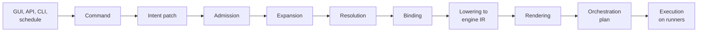
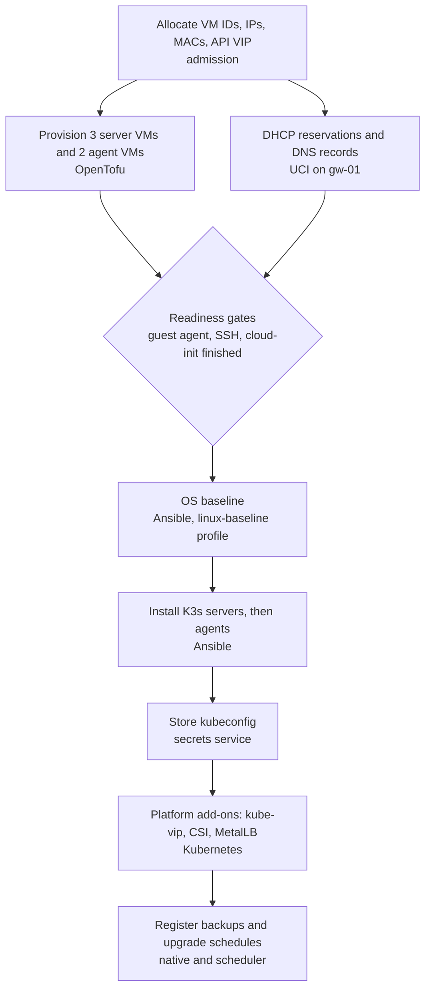
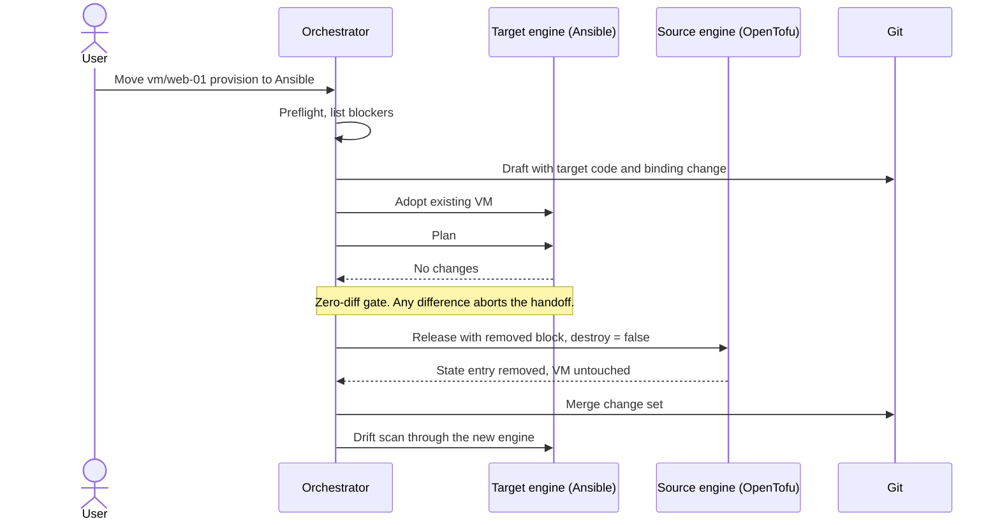

# 5. Intent Compiler, Engines and Interoperability

> Part of the [nodr technical design](../README.md).

This chapter describes the abstraction layer that turns GUI actions into
standard IaC code, the engines that execute that code, the plugin model that
makes engines replaceable, and how workflows move between Terraform, Ansible
and other tools.

## 5.1 Pipeline overview



Everything up to rendering is a pure function of the intent revision, a
snapshot of platform facts and the renderer versions pinned in `nodr.lock`.
Only orchestration and execution have side effects.

## 5.2 Commands: GUI actions as data

Every GUI interaction produces a typed **command**. A command is validated,
authorized and audited as a unit, and its handler produces an intent patch in
JSON Patch format (RFC 6902):

```json
{
  "command": "vm.setResources",
  "target": "VirtualMachine/web-01",
  "ifMatch": "sha256:9b1e40...",
  "changeSet": "cs-42",
  "reason": "The website cache needs more memory",
  "params": { "memory": { "size": "8Gi" } }
}
```

```json
[{ "op": "replace", "path": "/spec/resources/memory/size", "value": "8Gi" }]
```

Rules:

- The API and the CLI expose the same commands, so the GUI has no private
  capabilities.
- A wizard is a batch of commands that lands in one change set.
- Commands are described in the OpenAPI document, including their parameter
  schemas. GUI actions are generated from those descriptions.
- `resource.patch` is the generic command for Advanced Mode users who want to
  send arbitrary patches.

## 5.3 Compiler stages

| Stage | Input and output | Notes |
| ----- | ---------------- | ----- |
| **Admission** | Patched intent to admitted intent | Defaults, allocations, validation and policy ([§3.7](03-resource-model.md#37-admission)) |
| **Expansion** | Blueprint instances and composite kinds to primitive resources | `K3sCluster` expands into VMs, a configuration profile and schedules. Results are committed to Git. |
| **Resolution** | References to concrete objects | Resolves references, IPAM, node placement (capacity, affinity, maintenance state) and platform facts such as the Proxmox version and provider capabilities |
| **Binding** | Aspects to engines | Uses workspace bindings and the capability matrix ([§5.4](#54-engine-bindings-and-the-capability-matrix)) |
| **Lowering** | Resources to engine IR | One IR per engine: an HCL block tree, an Ansible inventory and variable graph, a UCI package and section tree, Kubernetes objects, a Compose project model |
| **Rendering** | IR to files | Lens `render` for new blocks and `put` for existing ones, provenance markers, canonical formatting for new code only |
| **Orchestration planning** | Changed units to a cross-engine execution graph | [§5.6](#56-cross-engine-orchestration) |

**Determinism.** Output depends only on intent, the facts snapshot and pinned
renderer versions. Each plan records the ID of its facts snapshot, so a
compilation can be reproduced exactly. Renderers avoid timestamps, random
values and unordered map iteration. Every renderer has golden-file tests.

**Incrementality.** Rendering results are cached by a content hash of the
resource, its dependencies and the renderer version. A change re-renders only
the resources whose inputs changed, which keeps the GUI's static diff under a
second.

## 5.4 Engine bindings and the capability matrix

Each aspect of each resource is bound to exactly one engine. Bindings resolve
in this order, first match wins:

1. A resource annotation, for example `nodr/binding.provision: ansible`.
2. A selector-based override in `nodr.yaml`.
3. The workspace default in `nodr.yaml`.
4. The plugin's default.

```yaml
spec:
  bindings:
    VirtualMachine/provision: opentofu
    VirtualMachine/guest: ansible
    Router/config: uci
  bindingOverrides:
    - selector: { matchLabels: { legacy: ansible } }
      bindings: { VirtualMachine/provision: ansible }
```

The **capability matrix** records what each engine can realize.
● full support, ◐ partial support, – not supported.
"Native" means nodr executors that call platform APIs directly.

| Kind and aspect | OpenTofu | Ansible | Native | UCI | Kubernetes | Compose |
| --------------- | :------: | :-----: | :----: | :-: | :--------: | :-----: |
| `ProxmoxCluster/bootstrap` (create, join) | – | ● | ◐ | – | – | – |
| `ProxmoxCluster/options` | ● | ◐ | ● | – | – | – |
| `ProxmoxNode/host` (networking, repositories, packages) | ◐ | ● | ◐ | – | – | – |
| `StoragePool/provision` | ● | ◐ | ● | – | – | – |
| `Template/build` | ● | ◐ | ● | – | – | – |
| `VirtualMachine/provision`, `LinuxContainer/provision` | ● | ● | ● | – | – | – |
| `VirtualMachine/ha` | ● | ◐ | ● | – | – | – |
| `VirtualMachine/guest`, `Host/guest` | – | ● | – | – | – | – |
| `Router/config` | – | ◐ | – | ● | – | – |
| `Router/firmware` | – | – | ● | – | – | – |
| `DockerHost/engine` | – | ● | – | – | – | – |
| `ComposeProject/deploy` | – | ◐ | – | – | – | ● |
| `K3sCluster/install` | – | ● | – | – | – | – |
| `KubernetesCluster/install` (Talos) | ● | – | ◐ | – | – | – |
| `Application/deploy` | ◐ | ◐ | – | – | ● | – |
| `BackupPolicy/jobs` | ◐ | ◐ | ● | – | – | – |

**Partial coverage is handled per field.** When a lens cannot realize a field,
for example because the pinned `bpg/proxmox` version has no resource for
Proxmox VE 9 HA resource-affinity rules, the compiler routes that sub-aspect
to an engine that can, here the native Proxmox executor. The user sees the
routing in the plan.

**The native engine has no code representation.** It executes intent
directly. In Advanced Mode, aspects bound to the native engine are edited as
intent YAML.

## 5.5 Engine code conventions

Generated code must read as if a careful engineer wrote it, and must run
without nodr ([§5.9.4](#594-export-and-eject)).

### OpenTofu and Terraform

- **State units.** Each unit is one root module with its own state. The
  default strategy is one unit per Proxmox cluster and environment, for
  example `terraform/pve-main-compute/`. Units keep plans fast and failures
  contained.
- **Files per unit.** `versions.tf` (pinned `required_providers`),
  `providers.tf`, `backend.tf`, `variables.tf` (inputs and secrets), one file
  per kind (`vms.tf`, `containers.tf`, `ha.tf`, `storage.tf`), and transient
  `imports.tf` and `moved.tf` files for adoption and renames.
- **Plain provider resources, no hidden modules.** Every attribute is visible
  and editable. Users who wrap managed blocks in their own modules turn them
  into user-owned code, and nodr offers to stop managing the matching intent
  resources.
- **State backend.** The `http` backend points to nodr's state service, which
  provides locking and versioning. Credentials are injected at runtime through
  the backend's standard environment variables (`TF_HTTP_USERNAME`,
  `TF_HTTP_PASSWORD`).
- **Secrets.** Declared as `sensitive` variables and filled from environment
  variables at runtime. With OpenTofu 1.11 or later, ephemeral values and
  write-only attributes are used where the provider supports them, so secrets
  never reach state.
- **State encryption.** With OpenTofu, nodr injects state and plan encryption
  through the `TF_ENCRYPTION` environment variable, so the code stays portable.
  With the Terraform CLI, the state service encrypts at rest instead.
- **Language level.** Rendered HCL uses the subset shared by OpenTofu 1.8+ and
  Terraform 1.8+, including `import`, `moved` and `removed` blocks.

```hcl
# terraform/pve-main-compute/backend.tf  (managed)
terraform {
  backend "http" {
    address        = "https://nodr.home.arpa/api/v1/state/home/pve-main-compute"
    lock_address   = "https://nodr.home.arpa/api/v1/state/home/pve-main-compute/lock"
    unlock_address = "https://nodr.home.arpa/api/v1/state/home/pve-main-compute/lock"
  }
}
```

### Ansible

- **Inventory.** A readable static inventory, `ansible/inventory/nodr.yml`,
  with groups derived from kinds, clusters and labels (`k3s_servers`,
  `env_prod`, `app_website`). The `nodr.platform.nodr` inventory plugin serves
  the same data live for users' own playbooks.
- **Variables are the lens target.** Managed variables use the `nodr_` prefix
  in `host_vars/` and `group_vars/`. Keys without the prefix are user-owned.
  Mapping intent to data files is simple and lossless.
- **Playbooks per aspect.** `guest.yml`, `pve-bootstrap.yml`, `docker.yml`,
  `k3s.yml`, and so on. They call roles from the open-source `nodr.platform`
  collection, pinned in `requirements.yml`. Configuration profiles can add the
  user's own roles.
- **Execution.** Through `ansible-runner`, whose JSON events drive live
  progress. Plans use check and diff mode. Tasks whose modules do not support
  check mode are marked "effect unknown" in the plan.
- **Secrets.** Passed as extra-vars files on a tmpfs inside the sandbox and
  never written to the repository. Tasks that handle secrets use `no_log`.

### UCI for OpenWrt

- One directory per device, one file per UCI package: `openwrt/gw-01/network`,
  `firewall`, `dhcp`, `wireless`, `system`.
- Managed sections are listed in `render.lock`. All other sections are
  user-owned and preserved.
- Secrets appear as placeholders such as `@secret(wifi/home-iot)` and are
  resolved by the executor at apply time.

### Kubernetes

- `kubernetes/<cluster>/infrastructure/` holds platform add-ons (kube-vip,
  MetalLB, CSI drivers, cert-manager). `kubernetes/<cluster>/apps/` holds
  applications. Both are Kustomize bases with overlays.
- In GitOps mode Helm charts are represented as Flux `HelmRelease` objects. In
  direct mode nodr stores the chart reference and values, and applies them with
  the Helm SDK.
- Server-side apply uses the field manager `nodr`.

### Docker Compose

- `compose/<host>/<project>/compose.yaml`, a `.env.template` that references
  secrets, and `images.lock` with resolved image digests ([§9.3](09-containers.md#93-compose-projects)).

## 5.6 Cross-engine orchestration

The orchestrator turns the dependency graph and aspect ordering into a
directed acyclic graph of engine jobs. Creating a K3s cluster looks like this:



- **Readiness gates** are typed checks between engines: guest agent responding,
  SSH reachable with the pinned host key, `cloud-init status --wait` finished,
  Kubernetes API healthy.
- **Outputs flow downstream, not into intent.** Engine outputs such as IP
  addresses, VM IDs and kubeconfigs are stored as resource status outputs and
  passed to later jobs as inputs. Only allocations are written to intent.
- **Failures stop dependents and keep completed work.** nodr never destroys
  resources automatically after a failure. The change set is marked
  *partially applied*, with *retry* and *resume* actions. Compensation runs
  only where a workflow declares it, for example "remove the VMs created in
  this change set if the K3s install fails".
- **Parallelism.** Independent branches run concurrently, limited by runner
  capacity and per-target locks.

## 5.7 Normalized plan format

Engine plans (OpenTofu plan JSON, Ansible check-mode events, UCI diffs,
Kubernetes dry-run diffs, Compose diffs) are normalized into one document that
the GUI, the API and approval rules consume:

```json
{
  "changeSet": "cs-42",
  "commit": "3f9c2e1",
  "factsSnapshot": "facts-20260925T081400Z",
  "summary": "Update 1 VM. web-01 needs a reboot to apply the memory change.",
  "changes": [
    {
      "resource": "VirtualMachine/web-01",
      "aspect": "provision",
      "engine": "opentofu",
      "action": "update",
      "impact": "reboot",
      "risk": "medium",
      "fields": [
        { "path": "spec.resources.memory.size", "before": "4Gi", "after": "8Gi" }
      ],
      "engineRef": {
        "stateUnit": "pve-main-compute",
        "address": "proxmox_virtual_environment_vm.web_01"
      }
    }
  ],
  "planHash": "sha256:5d0c7e..."
}
```

- **Impact classes:** `none`, `in-place`, `hot-plug`, `restart-service`,
  `reboot`, `replace`, `destroy`, plus a separate `dataLoss` flag for disk
  replacement and volume deletion.
- **Risk** combines impact, environment labels, protection flags and the
  number of dependent resources.
- **Summaries** are built from templates rather than generated freely, so they
  are deterministic and translatable.

## 5.8 Plugin architecture

A plugin is the unit of extension. The built-in integrations are plugins too.

| Contribution | Runs where | Purpose |
| ------------ | ---------- | ------- |
| Kinds and schemas | Control plane | New resource types and versions |
| Lenses | WebAssembly sandbox in the control plane | Render, put and lift for a kind, aspect and engine |
| Executors | Runner sandboxes (gRPC) | Validate, plan, apply, adopt and release for an engine or platform |
| Observers | Runner sandboxes (gRPC) | Discovery, facts and drift detection |
| Operations | Runner sandboxes (gRPC) | Imperative actions such as start, migrate, snapshot, console |
| Workflow steps | Runner sandboxes | Building blocks for schedules and workflows |
| Validation rules | Control plane (CEL or WebAssembly) | Semantic checks at admission |

Plugins do not ship arbitrary UI code in v1. Forms come from schemas and their
`x-nodr-ui` hints, which keeps the UI consistent and closes an obvious attack
surface.

### Manifest

```yaml
apiVersion: nodr/v1alpha1
kind: Plugin
metadata:
  name: proxmox
spec:
  version: 0.9.2
  requires: { nodr: ">= 1.0, < 2.0" }
  kinds:
    - { kind: VirtualMachine, versions: [v1alpha1], schema: schemas/virtualmachine.json }
    - { kind: LinuxContainer, versions: [v1alpha1], schema: schemas/linuxcontainer.json }
  lenses:
    - kind: VirtualMachine
      aspect: provision
      engine: opentofu
      module: lenses/vm-opentofu.wasm
      targets: { provider: bpg/proxmox, versions: ">= 0.80, < 1.0" }
  executors:
    - { engine: native, image: "oci://registry.example.com/nodr/plugin-proxmox:0.9.2" }
  operations: [vm.start, vm.shutdown, vm.migrate, vm.snapshot, vm.console]
  steps: [proxmox/cluster-health, proxmox/node-maintenance-enable, proxmox/node-maintenance-disable]
```

### Interfaces

Lens functions are exchanged as protobuf messages over a WebAssembly ABI.
Executors, observers and operations are gRPC services:

```protobuf
service Lens {
  rpc Render(RenderRequest) returns (RenderResponse);
  rpc Put(PutRequest) returns (PutResponse);
  rpc Lift(LiftRequest) returns (LiftResponse);
}

service Executor {
  rpc Validate(ValidateRequest) returns (Diagnostics);
  rpc Plan(PlanRequest) returns (stream PlanEvent);
  rpc Apply(ApplyRequest) returns (stream ApplyEvent);
  rpc Observe(ObserveRequest) returns (ObserveResponse);
  rpc Adopt(AdoptRequest) returns (AdoptResponse);        // take over existing objects
  rpc Release(ReleaseRequest) returns (ReleaseResponse);  // let go without destroying
  rpc Invoke(InvokeRequest) returns (stream InvokeEvent); // imperative operations
}
```

### Isolation, distribution and quality

- **Lenses are pure.** The WebAssembly sandbox gives them no I/O, clock or
  randomness, and limits memory and execution fuel. That makes them
  deterministic and safe to run inside the control plane.
- **Executors are isolated.** They run in runner sandboxes with only the
  credentials of the current job ([§10.7](10-security.md#107-runner-isolation-and-code-execution)).
- **Distribution.** Plugins are OCI artifacts signed with Sigstore. Their
  digests are pinned in `nodr.lock`. Offline bundles support air-gapped sites.
- **Conformance kit.** `nodr plugin test` runs lens-law property tests, golden
  files, schema checks and executor contract tests against recorded fixtures or
  live test targets. Passing it is required for listing in the plugin index.
- **Built-in plugins for v1:** `proxmox`, `pbs`, `openwrt`, `linux` (hosts and
  configuration profiles), `docker`, `k3s`, `kubernetes`, `talos`,
  `dns-dnsmasq`.

## 5.9 Workflow migration between tools

Interoperability works at three levels:

1. **Switch the engine** behind a resource or aspect without touching the
   infrastructure.
2. **Import** existing Terraform, Ansible, Compose and Kubernetes projects.
3. **Export** everything and leave nodr.

### 5.9.1 Engine handoff protocol

**Invariant: a handoff never changes infrastructure.**



1. **Preflight.** Check that the target engine can express every field in use.
   Code-owned expressions and extensions without an equivalent are listed as
   blockers, each with options: convert to a literal, drop, or keep that
   aspect on the source engine.
2. **Render** the target code with the target lens.
3. **Adopt** in the target engine: `import` blocks for OpenTofu, nothing for
   stateless Ansible, an ownership record for the native engine.
4. **Zero-diff gate.** The target plan must be empty. Lenses render explicit
   values rather than relying on engine defaults, so differences are rare; when
   they occur the handoff stops and shows them.
5. **Release** from the source engine: a `removed` block with
   `lifecycle { destroy = false }` for OpenTofu, removal of managed variables
   for Ansible, deletion of the ownership record for the native engine.
6. **Commit** the binding change.
7. **Verify** with a drift scan through the new engine.

Steps 3 to 5 run as one orchestrated run. If the release fails, the resource
is re-adopted by the source engine, so it is never left without an owner.

### 5.9.2 The same VM in two engines

With OpenTofu, `web-01` is the resource block from
[§4.9](04-dual-mode-and-sync.md#49-worked-example). With Ansible, the same
intent renders to data plus a role call:

```yaml
# ansible/host_vars/web-01.yml
# nodr:managed vm/web-01
nodr_vm:
  cluster: pve-main
  node: pve2
  vmid: 1012
  template: debian-12-cloud
  cores: 4
  cpu_type: x86-64-v2-AES
  memory_mib: 6144
  balloon_mib: 0
  disks:
    - { slot: scsi0, storage: ceph-vm, size_gib: 32, discard: true, ssd: true, iothread: true }
  nics:
    - { slot: net0, bridge: vmbr0, vlan: 20, mac: "BC:24:11:3A:5E:01" }
  ipconfig0: "ip=10.0.20.21/24,gw=10.0.20.1"
  tags: [app-website, env-prod, nodr]
  started: true
```

```yaml
# ansible/playbooks/provision.yml
- name: Provision Proxmox guests
  hosts: nodr_vms
  gather_facts: false
  roles:
    - nodr.platform.proxmox_vm   # calls the Proxmox API through community.proxmox modules
```

The `smbios` extension from the worked example has no equivalent in the
Ansible lens, so preflight reports it as a blocker. The user can pass it
through the role's raw Proxmox options, drop it, or keep `provision` on
OpenTofu.

### 5.9.3 Importing existing projects

| Source | What happens |
| ------ | ------------ |
| Terraform or OpenTofu project | All HCL is parsed. Resources that lenses understand become managed resources with generated intent; everything else stays user-owned. State moves into the nodr backend with `tofu init -migrate-state`, and a zero-diff plan confirms the import. |
| Ansible repository | Inventory hosts become `Host` resources, or are matched to discovered VMs by name, IP or MAC address. Roles and playbooks stay user-owned. Configuration profiles and schedules can reference them. |
| Compose files | Imported as `ComposeProject` resources whose `compose.yaml` stays user-owned |
| Kubernetes manifests and Helm values | Imported as `Application` resources with user-owned sources |
| Live systems | Discovery and adoption for Proxmox ([§6.3](06-proxmox.md#63-discovery-and-adoption)), OpenWrt ([§8.4](08-networking.md#84-openwrt-integration)), Docker and Kubernetes |

### 5.9.4 Export and eject

`nodr export` writes a standalone repository:

- `terraform/` units configured for a backend of the user's choice, with state
  exported,
- `ansible/` with a static inventory, variables, playbooks and a
  `requirements.yml` that references the open-source `nodr.platform`
  collection,
- `openwrt/` UCI files and a helper script that applies them over SSH,
- `kubernetes/` and `compose/` sources,
- schedules as documented YAML, plus optional systemd timer units that run the
  exported playbooks,
- a README that explains how to run everything.

Provenance markers remain as plain comments. Secrets are exported only on
request, as SOPS-encrypted files. CI exports a sample workspace on every
release and requires a zero-diff plan with plain OpenTofu and Ansible.

## 5.10 Supporting another tool

Adding an engine such as NixOS, Salt or Pulumi takes five steps:

1. Define the engine's code layout and IR.
2. Implement lenses for the kinds and aspects the tool should realize,
   satisfying the lens laws.
3. Implement an executor: validate, plan, apply, observe, adopt and release.
4. Declare the capabilities in the plugin manifest.
5. Pass the conformance kit.

For example, a NixOS plugin could realize `ConfigProfile` for the `guest`
aspect as NixOS modules applied with `nixos-rebuild --target-host`. A handoff
from Ansible would then work per aspect, exactly as described in
[§5.9.1](#591-engine-handoff-protocol).
