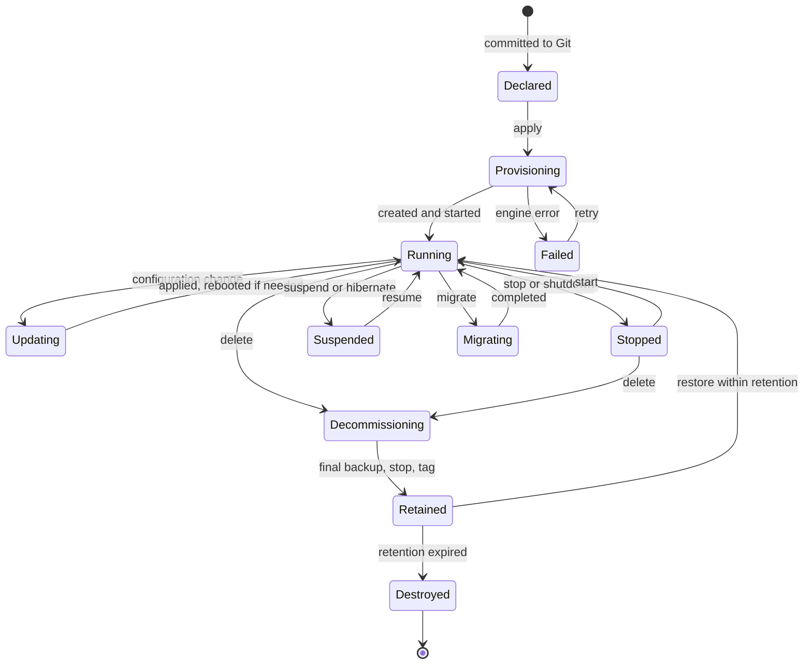

# 6. Proxmox VE Orchestration

> Part of the [nodr technical design](../README.md).

## 6.1 Scope

- Proxmox VE 8.x and 9.x, and Proxmox Backup Server (PBS) 3.x and 4.x.
- Topologies from a single node to clusters of up to 32 nodes.
- QEMU/KVM virtual machines and LXC containers, from creation to
  decommissioning.
- Cluster formation, high availability (HA), hyper-converged Ceph, storage,
  backups and host maintenance.

Engine bindings follow [§5.4](05-compiler-and-engines.md#54-engine-bindings-and-the-capability-matrix):
guest provisioning and cluster options default to OpenTofu with the
`bpg/proxmox` provider, host-level work (cluster bootstrap, packages, Ceph)
defaults to Ansible, and anything the provider cannot express is routed to the
native Proxmox API executor
([ADR-0005](../adr/0005-bpg-proxmox-provider-with-native-api-fallback.md)).

## 6.2 Connecting to Proxmox

**Bootstrap once, then least privilege.** During onboarding the user either
enters an administrator credential once or runs a short script on a node. nodr
uses it to create a dedicated `nodr@pve` user, a `NodrOperator` role and an API
token with privilege separation, and then discards the administrator
credential.

The role grants what nodr needs and nothing more. The exact privilege list is
generated per Proxmox VE version by the Proxmox plugin
(`nodr pve role-spec --version 9`). A representative subset:

| Area | Privileges |
| ---- | ---------- |
| Guests | `VM.Allocate`, `VM.Audit`, `VM.Clone`, `VM.Config.*`, `VM.PowerMgmt`, `VM.Migrate`, `VM.Snapshot`, `VM.Snapshot.Rollback`, `VM.Backup`, `VM.Console` |
| Storage | `Datastore.Allocate`, `Datastore.AllocateSpace`, `Datastore.AllocateTemplate`, `Datastore.Audit` |
| Organization | `Pool.Allocate`, `Pool.Audit`, `Mapping.Use`, `Mapping.Audit` |
| Networking | `SDN.Use`, `SDN.Audit` |
| Cluster | `Sys.Audit`, `Sys.Modify` (cluster options and HA) |

Connection details:

- **Endpoints.** Every node's API address is recorded. nodr fails over between
  them, so a node in maintenance does not block the cluster.
- **TLS.** Proxmox uses self-signed certificates by default. nodr pins the
  fingerprint on first contact after the user confirms it, or trusts ACME
  certificates when the cluster uses them.
- **SSH** is used only for host-level work that the API does not cover:
  cluster bootstrap, package upgrades on hosts and Ceph setup. It uses a
  dedicated key or short-lived SSH certificate ([§10.6](10-security.md#106-credentials-for-managed-systems)),
  and host keys are pinned.

## 6.3 Discovery and adoption

The observer reads `/cluster/status`, `/cluster/resources`, node network and
storage configuration, HA configuration, backup jobs, pools and tags, and the
configuration of every guest together with its `digest`.

The adoption wizard then:

1. Lists discovered objects with the kind nodr proposes for each.
2. Flags objects that other tools appear to manage, for example guests whose
   tags or descriptions mention Terraform.
3. Lets the user choose what to adopt. Nothing is adopted by default.
4. Generates intent, code and `import` blocks for the selection.
5. Runs a plan, which must be empty (the zero-diff gate), and commits the
   result.

Adopted guests keep their VM IDs. They start with `powerState: unmanaged` and
drift policy `notify`, so adopting never changes how a guest behaves.

## 6.4 Topologies

| | Single node | Two nodes | Three or more nodes |
| - | ----------- | --------- | ------------------- |
| Quorum | Not applicable | Needs a QDevice as third vote | Native |
| Storage | Local LVM-thin or ZFS | ZFS with storage replication | Ceph, NFS, iSCSI, or ZFS replication |
| HA | No | Yes, with data loss up to the replication interval | Yes |
| Live migration | No | Yes | Yes |
| nodr defaults | Backups to PBS or NFS, scheduled restore tests | QDevice wizard, replication every 15 minutes | Ceph wizard when every node has spare disks |

**Two-node clusters** lose quorum when one node fails, unless a third vote
exists. nodr's cluster wizard installs `corosync-qnetd` on an external device,
such as a Raspberry Pi or nodr's own host when nodr runs outside the cluster,
and configures the QDevice on both nodes.

## 6.5 Cluster lifecycle

### Creating a cluster and joining nodes

Cluster formation is the `proxmox/cluster-bootstrap` workflow, executed with
Ansible over SSH. Its preflight checks:

- all nodes run the same Proxmox VE major version,
- host names and addresses are unique and resolvable,
- time is synchronized,
- the corosync network is reachable with low, stable latency,
- joining nodes hold no guests, because joining replaces their `/etc/pve` and
  guest IDs could collide.

The workflow creates the cluster on the first node, joins the others with
their corosync link addresses (a dedicated `link0` and a redundant `link1` are
recommended), verifies quorum, records the nodes in intent and applies cluster
options.

### Removing a node

The `proxmox/node-remove` workflow enables maintenance mode, migrates guests
away, removes the node from HA rules, takes its Ceph OSDs out and waits for
rebalancing, runs `pvecm delnode` from a remaining node, cleans up and updates
intent. It reminds the operator that the removed node must not rejoin the
network with its old configuration.

### Ceph

Hyper-converged Ceph is set up through `pveceph` by an Ansible role: public
and cluster networks, three monitors, managers, one OSD per selected disk,
pools with `size 3` and `min_size 2`, and optionally CephFS. Every step is
gated on `HEALTH_OK`. RBD pools and CephFS appear as `StoragePool` resources.

### Cluster options

Rendered through `proxmox_virtual_environment_cluster_options`, for example:

| Intent field | Proxmox setting | nodr default |
| ------------ | --------------- | ------------ |
| `migration.type` | Migration type | `secure`; `insecure` only on a dedicated network |
| `migration.network` | Migration network (CIDR) | The fastest dedicated network, if any |
| `ha.shutdownPolicy` | HA shutdown policy | `conditional` |
| `ha.scheduler` | Cluster resource scheduler mode | `static` (uses configured guest resources) |
| `macPrefix` | MAC address prefix | Proxmox default |

### Upgrades

- **Minor updates** use the rolling update workflow in
  [§7.5](07-scheduler.md#75-workflows).
- **Major upgrades**, such as 8 to 9, are a guided workflow: run the official
  checker (`pve8to9 --full`) on every node and resolve its findings, upgrade
  Ceph first when the target release requires a newer Ceph, then upgrade node
  by node in maintenance mode. Mixed versions are tolerated only during the
  upgrade window, and nodr blocks other changes to the cluster until it ends.

## 6.6 High availability

### Readiness checks

Enabling HA on a guest runs these checks. Failed checks block the change and
explain how to fix it; warnings need acknowledgment.

| Check | Why it matters | Suggested fix |
| ----- | -------------- | ------------- |
| At least three votes (nodes or QDevice) | One failure must not cost quorum | Add a node or a QDevice |
| All guest disks on shared or replicated storage | Another node must be able to start the guest | Move disks, or enable ZFS replication |
| Watchdog active on every node | HA recovery relies on self-fencing | Enable the hardware watchdog or keep `softdog` |
| No node-local devices | USB or PCI passthrough without a cluster-wide resource mapping, or a local ISO in the CD drive, blocks recovery | Use resource mappings, eject the ISO |
| CPU model available on all nodes | `host` breaks live migration across different CPUs | Use a baseline model such as `x86-64-v2-AES` |
| Capacity with one node down (warning) | The remaining nodes must fit the guest | Reduce reservations or add capacity |
| Redundant corosync links (warning) | One network fault can split the cluster | Add `link1` |

### Rendering by version

HA intent is independent of the Proxmox version. The Proxmox plugin reads the
cluster version from platform facts and renders accordingly:

| Intent | Proxmox VE 8 | Proxmox VE 9 |
| ------ | ------------ | ------------ |
| `ha.enabled`, restart and relocate limits | HA resource | HA resource |
| Preferred or allowed nodes | HA group | HA node-affinity rule (HA groups are deprecated in 9 and migrated automatically on upgrade) |
| `affinity.separateFrom`, `affinity.keepWith` | Not available: nodr enforces it at placement time and reports violations as drift | HA resource-affinity rule, negative or positive |

```hcl
# nodr:managed vm/web-01#ha
resource "proxmox_virtual_environment_haresource" "web_01" {
  resource_id  = "vm:${proxmox_virtual_environment_vm.web_01.vm_id}"
  state        = "started"
  max_restart  = 2
  max_relocate = 1
  comment      = "Managed by nodr"
}
```

When the pinned provider version has no resource for affinity rules, the
compiler routes that sub-aspect to the native executor
([§5.4](05-compiler-and-engines.md#54-engine-bindings-and-the-capability-matrix)).
For HA guests with `placement.node: auto`, the lens renders
`lifecycle { ignore_changes = [node_name] }`, so OpenTofu never tries to move a
guest back after a failover.

### Power state under HA

For HA-managed guests, nodr expresses power changes as HA resource states,
which matches how Proxmox itself routes such requests. The desired state and
the HA manager therefore never fight:

| `lifecycle.powerState` | HA resource state |
| ---------------------- | ----------------- |
| `running` | `started` |
| `stopped` | `stopped` |
| `unmanaged` | Not set by nodr; the guest stays under HA |

### Maintenance and rebalancing

Node maintenance mode (`ha-manager crm-command node-maintenance enable <node>`)
moves HA guests away. nodr's workflows migrate non-HA guests themselves, or
shut them down when the guest's policy says so. When platform facts show that
the cluster supports automatic HA rebalancing, nodr exposes it as a cluster
option.

## 6.7 VM and container lifecycle



### Creation paths

| Path | Use | How |
| ---- | --- | --- |
| Clone a cloud-image template | Default for Linux guests | Full clone of a `Template`, configured by cloud-init |
| Install from ISO | Windows, appliances, special cases | ISO on a storage, installation through the browser console |
| Import a disk image | Appliances shipped as qcow2, VMDK or OVA | Proxmox disk import through an import-capable storage |
| Import from another hypervisor | Migrations, for example from ESXi | Proxmox import storage, orchestrated and then adopted |
| LXC from a template | Lightweight Linux services | Proxmox template repository or a custom template |
| Restore from backup | Recovery or duplication | New guest from a PBS snapshot, with a new identity |

### Templates

A `Template` resource names a cloud image URL and checksum, the OS family and
default cloud-init settings. nodr downloads the image to a storage, builds a
template in the template VM ID range and versions it (for example
`debian-12-cloud` built in 2026-09). A monthly rebuild keeps images current;
existing guests are full clones and are unaffected. A Packer plugin can build
golden images with software baked in.

### Declarative settings versus operations

Configuration is declarative. Runtime actions are operations
([ADR-0008](../adr/0008-separate-day-2-operations-from-desired-state.md)):

| Action | Kind | Effect on intent |
| ------ | ---- | ---------------- |
| Change CPU, memory, NICs, cloud-init | Declarative | The change itself |
| Grow a disk | Declarative | `disks[].size`. Shrinking is rejected at admission. |
| Move a disk to another storage | Declarative | `disks[].storage`, executed online through the move-disk API |
| Start, stop, shut down | Operation | Recorded as a `powerState` change when the power state is managed; otherwise none |
| Reboot, reset, suspend, resume, hibernate | Operation | None |
| Migrate | Operation | None with `node: auto`; with a pinned node, nodr asks whether to change the pin |
| Snapshot, roll back, delete snapshot | Operation | None; automatic snapshots come from `SnapshotPolicy` |
| Clone | Operation | Creates a new resource |
| Back up now, restore | Operation | Restoring over an existing guest needs confirmation |
| Convert to template | Operation | Creates a `Template` and removes the VM resource |
| Console | Operation | None. noVNC for VMs and xterm.js for containers and serial consoles, proxied through nodr with short-lived Proxmox tickets. |

### Hot-plug and reboots

Whether a change applies live depends on the guest's hot-plug settings (CPU
and memory hot-plug, NUMA for memory) and the guest OS. nodr reads these from
platform facts and predicts the impact as `hot-plug` or `reboot`. Proxmox
marks changes that need a restart as pending. nodr then offers three choices:
reboot now, reboot in the next maintenance window (a one-off scheduled run),
or leave the change pending with a visible badge.

### Deleting safely

- The Proxmox `protection` flag is on by default. Removing it is an explicit
  change in the change set.
- Deleting in the GUI requires typing the resource name. The plan marks the
  change as `destroy` with the `dataLoss` flag.
- **Retention.** Deleted guests are first backed up (default for `prod`),
  stopped and tagged `nodr-retained`, and destroyed after a retention period
  (default 7 days). Restoring within the period is one action.

### Placement

For `placement.node: auto`, the placement engine scores nodes by free memory
under the overcommit policy, CPU load, availability of the template and target
storage, affinity rules, maintenance state and node labels such as `gpu=true`.
Ties break deterministically by node name. The result is stored in
`placement.assignedNode`.

### Identity and metadata

- VM IDs come from the environment ranges in `nodr.yaml`
  ([§3.9](03-resource-model.md#39-allocations)).
- Tags: `nodr`, `env-<environment>` and `app-<app>`.
- The guest description ends with a nodr footer containing the resource
  `uid`. The observer uses it to recognize managed guests after renames and to
  spot guests managed by other tools.
- The baseline configuration profile installs the QEMU guest agent, which
  provides IP discovery, filesystem freeze and thaw around backups and
  snapshots, and clean shutdowns.

## 6.8 Storage and backup

- **Storage pools.** `StoragePool` covers directory, LVM-thin, ZFS, NFS, CIFS,
  CephFS, RBD and PBS storages, with content types, the shared flag and node
  restrictions.
- **Backup targets.** A `BackupTarget` for PBS names a datastore and a
  namespace per workspace or environment. nodr generates client-side
  encryption keys, stores them in the secrets service and prompts the user to
  print the paper key that PBS can export, because encrypted backups are
  useless without it.
- **Server-side jobs.** Prune, garbage collection and verification jobs are
  configured on PBS itself, and sync jobs to an off-site PBS implement the
  3-2-1 rule.
- **Backup jobs.** `BackupPolicy` compiles to Proxmox cluster backup jobs, so
  backups run even when nodr is down ([§7.6](07-scheduler.md#76-native-delegation)).
- **Restore tests.** A scheduled workflow restores a recent backup into an
  isolated network without uplink, boots it, runs health checks (guest agent,
  HTTP), destroys it and reports the result. Backups are only trusted once they
  have been restored.

## 6.9 Failure modes and safeguards

| Failure | Detection | Behavior |
| ------- | --------- | -------- |
| Quorum lost during a run | Cluster status, write errors | Stop the run, no write retries until quorum returns, alert |
| Node fenced during a run | Cluster status, HA events | Mark affected steps failed, let HA recover guests, re-plan after recovery |
| Guest locked by a backup, migration or snapshot | Proxmox lock error | Transient: retry with backoff up to a limit, show the lock reason |
| Proxmox task failed | Exit status of the task (UPID) | Map to the error taxonomy and attach the task log to the run |
| Storage full | API error, capacity facts | Invalid: block with remediation (free space or choose another storage) |
| Provider timeout | Engine error | Transient: refresh, re-plan and retry |
| API token expired or revoked | HTTP 401 | Fatal: alert and link to the credential settings |
