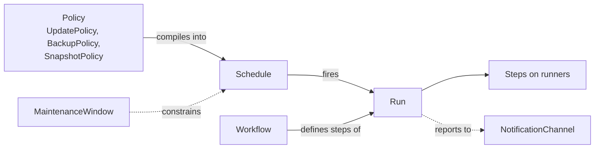
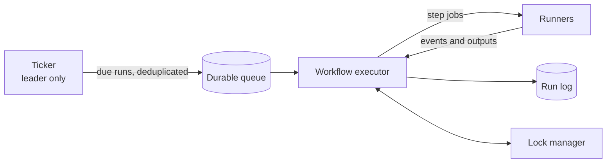
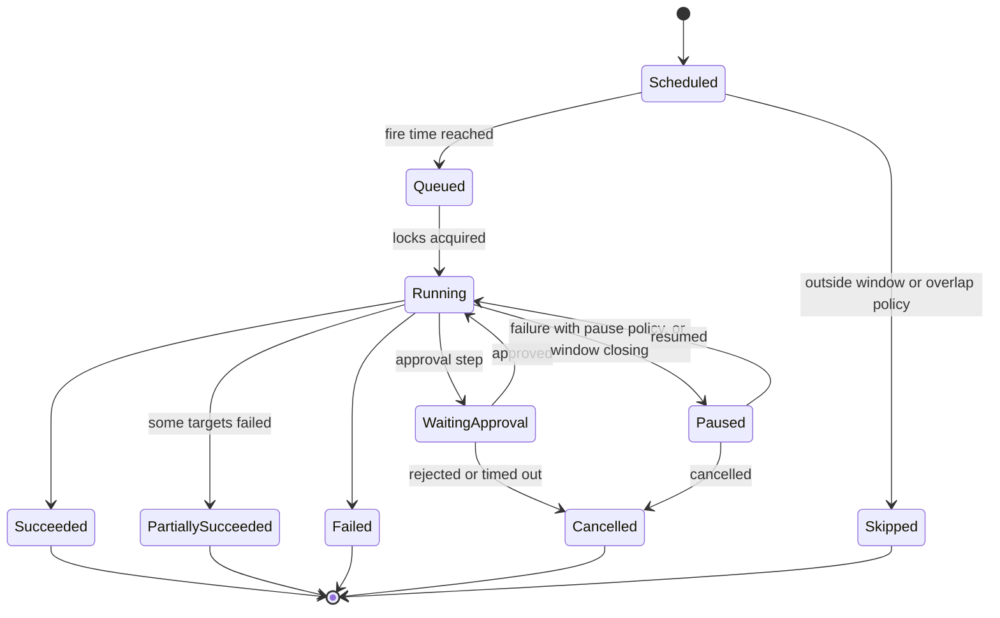

# 7. Automation and Scheduling

> Part of the [nodr technical design](../README.md).

## 7.1 Concepts



| Concept | Answers | Audience |
| ------- | ------- | -------- |
| **Policy** | "What outcome do I want?" For example: security updates weekly, with a snapshot first. | Beginners; selected in forms |
| **Schedule** | "When does it run?" | Everyone |
| **Workflow** | "Which steps, in which order, with which safety checks?" | Power users; built-in workflows cover common cases |
| **Run** | "What happened this time?" | Everyone |
| **MaintenanceWindow** | "When is disruption allowed?" | IT teams |

Policies, schedules, workflows and windows are intent documents in Git, so
automation is reviewed, versioned and audited like any other change.

## 7.2 Built-in policies

### UpdatePolicy

```yaml
apiVersion: nodr/v1alpha1
kind: UpdatePolicy
metadata:
  name: security-weekly
spec:
  packages: security             # security | all | none
  window: sunday-early           # MaintenanceWindow
  snapshotBefore: true           # guests on snapshot-capable storage
  reboot: ifRequired             # never | ifRequired | always
  healthChecks: [agent, ssh, services]
  onFailure: rollbackSnapshot    # rollbackSnapshot | pause | continue
  rollout:
    canary:
      selector: { matchLabels: { canary: "true" } }
      soak: 24h                  # the rest waits for the next window after the soak
    maxParallel: 2
  notify: [ops-ntfy]
```

Resources refer to a policy explicitly (`spec.policies.updates`). A policy may
also declare a label selector for bulk attachment; an explicit reference wins.

What "updates" means depends on the target:

| Target | Mechanism |
| ------ | --------- |
| Linux guests and hosts | `apt`, `dnf` or `apk`, run by Ansible |
| Proxmox VE nodes | Rolling cluster update with maintenance mode, always `apt full-upgrade` ([§7.5](#75-workflows)) |
| Proxmox Backup Server | Package upgrade outside backup and verification jobs |
| OpenWrt devices | Firmware upgrade through Attended Sysupgrade ([§8.4](08-networking.md#84-openwrt-integration)) |
| K3s clusters | system-upgrade-controller plans, gated by the window ([§9.4](09-containers.md#94-k3s-clusters)) |
| Compose projects | Image digest updates by semantic-version rule ([§9.3](09-containers.md#93-compose-projects)) |
| Applications | Chart version updates by semantic-version rule |

### BackupPolicy

```yaml
apiVersion: nodr/v1alpha1
kind: BackupPolicy
metadata:
  name: nightly-7d4w
spec:
  target: pbs-main               # BackupTarget
  trigger: { cron: "30 1 * * *", timezone: Europe/Berlin }
  mode: snapshot                 # snapshot | suspend | stop
  retention: { keepDaily: 7, keepWeekly: 4, keepMonthly: 6 }
  restoreTest: { every: month, sample: 1 }
  notify: { onFailure: [ops-ntfy] }
  execution: auto                # native when possible, see 7.6
```

### SnapshotPolicy

Periodic snapshots with retention, and pre-change snapshots before risky
changes (updates, major configuration changes). Snapshots depend on the
storage type; admission warns when a guest's storage cannot take them.

### Scheduled restarts

Restarts are a schedule that runs the built-in `core/rolling-restart`
workflow for a label selector, with health checks between targets:

```yaml
apiVersion: nodr/v1alpha1
kind: Schedule
metadata:
  name: nightly-app-restart
spec:
  trigger: { cron: "15 4 * * *", timezone: Europe/Berlin }
  workflow: core/rolling-restart
  params:
    selector: { matchLabels: { restart: nightly } }
    maxParallel: 1
    healthChecks: [http]
```

## 7.3 Schedules

### Triggers

| Trigger | Example | Notes |
| ------- | ------- | ----- |
| Cron | `cron: "0 3 * * 0"` | Five-field cron with a time zone |
| Calendar rule | `rrule: "FREQ=MONTHLY;BYDAY=1SA"` | RFC 5545 recurrence rules for cases cron cannot express, such as "first Saturday of the month" |
| Interval | `every: 6h` | Anchored to the schedule's creation time |
| Window | `window: sunday-early` | Starts when a maintenance window opens |
| Event | `on: drift.detected`, `on: backup.succeeded` | Internal events or signed incoming webhooks |
| Manual | `manual: true` | Runbooks started from the GUI, CLI or API |

### Time semantics

- **Time zones.** Every schedule has an IANA time zone.
- **Daylight saving time.** A local time that does not exist (spring forward)
  runs at the next valid time. A local time that occurs twice (fall back) runs
  once, at the first occurrence.
- **Jitter.** Optional random delay (`jitter: 5m`), so many schedules do not
  hit the same system at the same second.
- **Missed runs.** When nodr was down at fire time: `skip`, `runOnce` within
  a grace period (default: once within 6 hours), or `runAll`. A missed run
  never starts outside its maintenance window.
- **Overlap.** `allow`, `forbid` (skip if the previous run is still going) or
  `replace` (cancel the previous run), as in Kubernetes CronJobs.
- **Circuit breaker.** After three consecutive failures a schedule pauses
  itself and alerts, so a broken workflow cannot keep doing damage.

```yaml
apiVersion: nodr/v1alpha1
kind: Schedule
metadata:
  name: pve-main-rolling-update
spec:
  trigger: { window: sunday-early }
  workflow: pve-rolling-update
  params: { cluster: pve-main }
  concurrency: forbid
  missedRuns: { policy: runOnce, within: 6h }
  jitter: 5m
  execution: central
  notify: [ops-ntfy]
```

## 7.4 Maintenance windows

```yaml
apiVersion: nodr/v1alpha1
kind: MaintenanceWindow
metadata:
  name: sunday-early
spec:
  timezone: Europe/Berlin
  recurrence: "FREQ=WEEKLY;BYDAY=SU"
  start: "02:00"
  duration: 4h
  finishBy: 30m                  # no new disruptive steps in the last 30 minutes
  blackout:
    - { from: 2026-12-20, to: 2027-01-03, reason: Holiday change freeze }
```

- Disruptive steps (reboots, migrations, firmware upgrades) start only inside
  a window. Non-disruptive steps (scans, downloads, backups) can run outside.
- When `finishBy` is reached, running steps complete but no new disruptive
  step starts. The run pauses and continues in the next window, or asks an
  operator.
- Resources join windows through policies or labels. The "reboot in the next
  window" choice for pending changes ([§6.7](06-proxmox.md#67-vm-and-container-lifecycle))
  also uses windows.
- Administrators can open an emergency window. The action is audited.

## 7.5 Workflows

Workflows are YAML documents with parameters, steps, conditions and failure
handling. Expressions use CEL inside `${{ }}`, evaluated on parsed values.

| Construct | Purpose |
| --------- | ------- |
| `uses` | A step from the step library, a plugin or another workflow |
| `with` | Step inputs |
| `when` | Condition, for example `${{ steps.upgrade.outputs.rebootRequired }}` |
| `forEach`, `order`, `maxParallel`, `maxUnavailable` | Rolling execution over targets |
| `retry`, `timeout` | Per-step reliability settings, for transient errors only |
| `onFailure` | `pause`, `continue`, `abort`, or compensation steps |
| `finally` | Steps that always run, such as cleanup |
| `approval/request` | A manual gate with timeout and eligible approvers |

### Step library

| Category | Steps (examples) |
| -------- | ---------------- |
| `proxmox/*` | `cluster-health`, `node-maintenance-enable`, `node-maintenance-disable`, `evacuate-non-ha`, `snapshot`, `snapshot-rollback`, `snapshot-delete`, `backup`, `restore`, `migrate` |
| `os/*` | `upgrade-packages`, `reboot` (boot-ID aware), `service-restart`, `run-command` (restricted) |
| `ceph/*` | `set-flag`, `unset-flag` |
| `openwrt/*` | `backup-config`, `sysupgrade`, `apply-config` |
| `k8s/*` | `cordon`, `drain`, `uncordon`, `etcd-snapshot`, `rollout-restart` |
| `docker/*` | `compose-pull`, `compose-up`, `compose-restart`, `image-prune` |
| `nodr/*` | `create-changeset`, `plan`, `apply-changeset`, `drift-scan` |
| `wait/*` | `node-online`, `ceph-healthy`, `k8s-node-ready`, `http`, `tcp`, `duration` |
| `health/*`, `notify/*`, `approval/*` | Health checks, notifications, manual gates |
| `script/run` | A sandboxed script on a runner; requires `code:write` |

### Example: safe guest update

```yaml
apiVersion: nodr/v1alpha1
kind: Workflow
metadata:
  name: guest-safe-update
spec:
  params:
    target: { kind: [VirtualMachine, LinuxContainer, Host] }
    packages: { enum: [security, all], default: security }
  steps:
    - id: snapshot
      uses: proxmox/snapshot
      with: { name: "pre-update-${{ run.id }}" }
      when: ${{ params.target.kind != 'Host' }}
    - id: upgrade
      uses: os/upgrade-packages
      with: { scope: "${{ params.packages }}" }
    - id: reboot
      uses: os/reboot
      when: ${{ steps.upgrade.outputs.rebootRequired }}
    - id: verify
      uses: health/check
      with: { checks: [agent, ssh, services], timeout: 10m }
  onFailure:
    - uses: proxmox/snapshot-rollback
      with: { name: "pre-update-${{ run.id }}" }
      when: ${{ steps.snapshot.succeeded }}
    - uses: notify/send
      with: { severity: error }
  finally:
    - uses: proxmox/snapshot-delete
      with: { name: "pre-update-${{ run.id }}", after: 24h }
      when: ${{ run.succeeded }}
```

### Example: rolling Proxmox cluster update

```yaml
apiVersion: nodr/v1alpha1
kind: Workflow
metadata:
  name: pve-rolling-update
spec:
  params:
    cluster: { kind: ProxmoxCluster }
  steps:
    - id: preflight
      uses: proxmox/cluster-health       # quorum, HA manager, Ceph HEALTH_OK
    - id: nodes
      forEach: ${{ params.cluster.nodes }}
      order: nodrHostLast                # the node that hosts nodr goes last
      maxParallel: 1
      steps:
        - uses: proxmox/node-maintenance-enable   # HA guests move away
        - uses: proxmox/evacuate-non-ha           # migrate or shut down per guest policy
        - uses: ceph/set-flag
          with: { flag: noout }
          when: ${{ params.cluster.spec.ceph.enabled }}
        - id: upgrade
          uses: os/upgrade-packages
          with: { scope: all, mode: full-upgrade }
        - uses: os/reboot
          when: ${{ steps.upgrade.outputs.rebootRequired }}
        - uses: wait/node-online
          with: { timeout: 20m }
        - uses: ceph/unset-flag
          with: { flag: noout }
          when: ${{ params.cluster.spec.ceph.enabled }}
        - uses: wait/ceph-healthy
          with: { timeout: 60m }
          when: ${{ params.cluster.spec.ceph.enabled }}
        - uses: proxmox/node-maintenance-disable
      onFailure: pause                   # never continue to the next node after a failure
    - uses: notify/summary
```

## 7.6 Native delegation

Where a platform has a built-in scheduler that is more resilient than an
external one, nodr configures it instead of running the task itself. Native
jobs keep running when nodr is down
([ADR-0009](../adr/0009-prefer-native-schedulers-where-more-resilient.md)).

| Task | Native mechanism | Used when |
| ---- | ---------------- | --------- |
| Guest backups (`BackupPolicy`) | Proxmox cluster backup job with prune settings | The trigger is exactly representable as a Proxmox calendar event in the node's time zone and there are no pre or post hooks |
| PBS maintenance | PBS prune, garbage collection, verification and sync jobs | Always |
| K3s etcd snapshots | `etcd-snapshot-schedule-cron` and retention in the K3s configuration | Always, for K3s with embedded etcd |
| K3s upgrades | system-upgrade-controller plans; nodr changes the target version only inside the window | Always |
| ZFS replication | Proxmox storage replication jobs | Always |
| OS security updates | `unattended-upgrades` or `dnf-automatic` on the guest | Only if the user chooses on-host patching, which gives up central snapshots and health checks |

Everything else runs **centrally**: multi-step and cross-system procedures,
anything that needs snapshots, health checks, approvals or rollback, and
rolling operations across nodes. `execution: auto` picks native delegation when
the conditions above hold. `native` and `central` force a choice, and admission
explains when `native` is not possible.

**Observing native jobs.** nodr collects results from Proxmox task history and
notification webhooks, PBS task logs, K3s snapshot lists and
system-upgrade-controller plan status. Native runs appear in the same run
history, marked as native, and feed the same alerts and reports.

## 7.7 Execution engine



### Durability

- The run state (step status, outputs, attempts) is persisted after every
  transition as an append-only run log. Any server replica can resume a run.
- The ticker materializes due runs with a deduplication key made of the
  schedule and its fire time, so each fire time produces exactly one run, even
  across replicas and restarts.
- Step jobs hold leases with heartbeats. When a runner disappears, the lease
  expires and the step is retried according to its idempotency rules.

### Idempotency

Every step has a deterministic idempotency key (run, step path, attempt
group). Executors check for prior completion before acting. Actions that are
not naturally idempotent are guarded:

| Step | Guard |
| ---- | ----- |
| `os/reboot` | Records the boot ID before rebooting. On resume, a changed boot ID means the reboot happened. |
| `proxmox/snapshot` | Deterministic snapshot name; "already exists" counts as success. |
| `nodr/apply-changeset` | Bound to a commit SHA and plan hash; an already applied plan is a no-op. |
| `os/upgrade-packages` | Naturally idempotent. |

Cancellation is cooperative: running steps are asked to stop, and `finally`
steps always run. Retries apply only to transient errors and use exponential
backoff with jitter. Every step and run has a timeout.

### Locks and concurrency

nodr uses multi-granularity locking over the hierarchy
workspace → cluster → node → guest, with intention locks. A cluster-wide
rolling update and a backup of one guest can therefore coordinate without
locking the whole workspace.

| Running | Requested on the same target | Result |
| ------- | ---------------------------- | ------ |
| Backup | Update, reboot, migrate | Queued until the backup finishes |
| Update | Backup | Queued |
| Change-set apply | Workflow step that changes the same resource | Queued |
| Node maintenance | Placement of new guests on that node | Placement skips the node |

`maxParallel` limits concurrency within a policy or workflow. Runners have
global capacity limits. A workspace-wide **change freeze** blocks applies and
disruptive workflows, with an audited emergency override for administrators.

### Run states



## 7.8 Update intelligence

- **Discovery.** A scheduled scan collects available updates per target:
  package lists from guests and hosts, the Proxmox and PBS package APIs,
  OpenWrt firmware releases for each device's board, K3s release channels,
  container image tags and digests, and Helm chart versions.
- **Classification.** Security updates are identified by their source, such
  as the Debian security suite, the Ubuntu `-security` pocket or `dnf`
  advisories. Reboot needs are detected with `/var/run/reboot-required` on
  Debian and Ubuntu, `needs-restarting -r` on RHEL-like systems, and by
  comparing running and installed kernels on Proxmox hosts.
- **Presentation.** An *Updates* page lists pending updates by severity and
  target, with the policy that will handle each and when. "Update now" runs
  the same workflow as the schedule.
- **Phased rollout.** Canary groups are updated first and must stay healthy
  for the soak period before the rest follow.

## 7.9 Notifications and reporting

- **Channels:** email (SMTP), ntfy, Gotify, Matrix, Discord, Slack, Telegram
  and generic webhooks signed with HMAC.
- **Routing** by severity, event type and labels, with quiet hours,
  deduplication and rate limits.
- **Reports:** a summary for every run, and a weekly digest covering updates
  applied, reboots pending, backup success rate, restore-test results, open
  drift and upcoming certificate expiry.

## 7.10 Health checks and rollback

| Health check | Passes when |
| ------------ | ----------- |
| `agent` | The QEMU guest agent answers |
| `ssh` | SSH connects with the pinned host key |
| `services` | Listed systemd units are active |
| `http` | The URL returns the expected status, and optionally matches a body pattern |
| `tcp`, `icmp` | The port accepts connections, or the host answers pings |
| `k8s-node-ready` | The node is `Ready` and its pods are running |
| `ceph-healthy` | Ceph reports `HEALTH_OK` |
| `pve-quorum` | The cluster is quorate |
| `custom` | A sandboxed script exits with status 0 |

| Change | Rollback strategy |
| ------ | ----------------- |
| Guest OS update | Roll back the pre-update snapshot. Downgrading packages is not reliable, so the snapshot is the rollback. |
| Configuration managed as code | Revert the change set in Git and apply it |
| OpenWrt configuration | Automatic rollback by the device ([§8.4](08-networking.md#84-openwrt-integration)), or restore the pre-change backup |
| OpenWrt firmware | Restore the configuration backup onto the previous image, which requires operator confirmation |
| K3s upgrade | Pin the previous version; an etcd snapshot restore needs operator confirmation |
| Compose image update | Redeploy the previous image digests from `images.lock` history |
