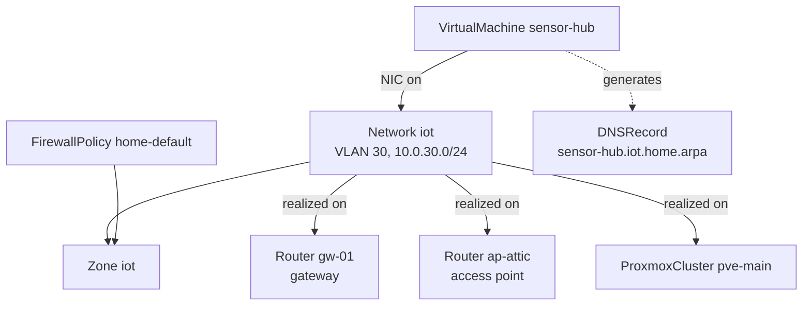
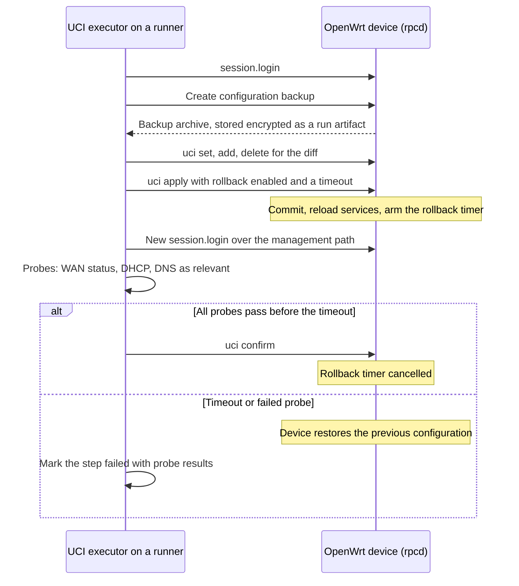

# 8. Network Management

> Part of the [nodr technical design](../README.md).

## 8.1 Scope

- **OpenWrt** routers and access points on the releases supported at design
  time (23.05, 24.10 and 25.12), on both DSA and older swconfig targets.
- **Proxmox host networking**: bridges, bonds, VLANs and SDN.
- **IP address management (IPAM), DHCP and DNS** across all of them.
- **Firewall policy, port forwards and WireGuard VPNs.**

Out of scope for v1: switches that do not run OpenWrt, routers running other
systems (pfSense, OPNsense, RouterOS), which plugins can add later, and
dynamic routing protocols, which remain available as code extensions.

## 8.2 Network model



The `Network` kind is shown in [§3.13](03-resource-model.md#313-examples). A
router and a firewall policy look like this:

```yaml
apiVersion: nodr/v1alpha1
kind: Router
metadata:
  name: gw-01
spec:
  role: gateway                   # gateway | access-point
  connection:
    address: 10.0.10.1
    transport: ubus-https         # ubus-https | ssh
    credentialsRef: openwrt/gw-01
  ports:
    wan: { device: wan, proto: dhcp }
    trunks: [lan1]                # tagged member of every network realized here
    access:
      lan4: { network: lan }      # untagged member of one network
  radios:
    radio0: { band: 2g, channel: auto, country: DE }
    radio1: { band: 5g, channel: 36, width: 80 }
  policies:
    updates: firmware-quarterly
---
apiVersion: nodr/v1alpha1
kind: FirewallPolicy
metadata:
  name: home-default
spec:
  zones:
    lan:   { trust: trusted }
    iot:   { trust: isolated }         # internet, plus DNS, DHCP and NTP on the gateway
    guest: { trust: internet-only }
    dmz:   { trust: exposed }          # reachable only through port forwards
    mgmt:  { trust: restricted }       # reachable only from admin devices
  exceptions:
    - from: iot
      to: { resource: VirtualMachine/home-assistant }
      ports: [8123/tcp]
      reason: Sensors report to Home Assistant
```

## 8.3 Define once, realize everywhere

A `Network` is defined once and realized on every system that needs it:

| Network field | OpenWrt | Proxmox VE | Kubernetes |
| ------------- | ------- | ---------- | ---------- |
| `vlan` | A `bridge-vlan` on the router bridge, tagged on trunk ports | VLAN tag on guest NICs over a VLAN-aware bridge, or an SDN VNet in a VLAN zone | Not applicable |
| `ipv4.subnet`, `gateway` | Interface with a static address on the gateway | cloud-init IP settings for guests | Load-balancer address pools from an IPAM range |
| `ipv4.dhcp` | A dnsmasq pool | Not applicable | Not applicable |
| Static allocations | `host` entries (MAC, IP, name) | Deterministic guest MAC addresses | Not applicable |
| `dns.domain` | Local records in dnsmasq | Search domain for guests | Records for load-balancer services |
| `zone` | fw4 zone, forwardings and rules | Optional Proxmox firewall security group | Not applicable |
| `wireless` | A `wifi-iface` on each access point | Not applicable | Not applicable |

## 8.4 OpenWrt integration

### Onboarding

Requirements: a supported release with `rpcd` and `uhttpd-mod-ubus`, which
LuCI installs, reachable over HTTPS, or SSH as a fallback.

1. The user enters an administrator credential once.
2. nodr creates a dedicated rpcd login with an ACL that allows UCI access to
   the managed packages, service reloads and the few commands nodr needs, such
   as creating a configuration backup. The administrator credential is then
   discarded.
3. nodr discovers the board, target, release, switch model (DSA or swconfig),
   radios and installed packages.
4. The current configuration is adopted as intent. The rendered UCI must match
   what is on the device (the zero-diff gate) before anything is committed.

### Transport

- **Preferred:** ubus JSON-RPC over HTTPS, with a session login. rpcd checks
  every call against the ACL.
- **Fallback:** SSH with key authentication, running `uci` in batch mode. This
  path is also used for firmware operations.

### Rendering and ownership

One file per UCI package and device. Excerpts for the `iot` network on the
gateway:

```text
# openwrt/gw-01/network
config bridge-vlan 'nodr_brlan_v30'
	option device 'br-lan'
	option vlan '30'
	list ports 'lan1:t'

config interface 'iot'
	option device 'br-lan.30'
	option proto 'static'
	option ipaddr '10.0.30.1'
	option netmask '255.255.255.0'
```

```text
# openwrt/gw-01/dhcp
config dhcp 'iot'
	option interface 'iot'
	option start '100'
	option limit '150'
	option leasetime '12h'

config host 'nodr_lease_sensor_hub'
	option name 'sensor-hub'
	option mac 'BC:24:11:7C:21:0A'
	option ip '10.0.30.20'

config domain 'nodr_dns_sensor_hub'
	option name 'sensor-hub.iot.home.arpa'
	option ip '10.0.30.20'
```

```text
# openwrt/gw-01/firewall
config zone 'nodr_zone_iot'
	option name 'iot'
	list network 'iot'
	option input 'REJECT'
	option output 'ACCEPT'
	option forward 'REJECT'

config forwarding 'nodr_fwd_iot_wan'
	option src 'iot'
	option dest 'wan'

config rule 'nodr_iot_dns'
	option name 'iot: DNS to gateway'
	option src 'iot'
	option dest_port '53'
	list proto 'tcp'
	list proto 'udp'
	option target 'ACCEPT'
```

```text
# openwrt/ap-attic/wireless
config wifi-iface 'nodr_wifi_iot_radio0'
	option device 'radio0'
	option mode 'ap'
	option network 'iot'
	option ssid 'Home-IoT'
	option encryption 'sae-mixed'
	option key '@secret(wifi/home-iot)'
```

- Managed sections are recorded in `render.lock`. Their names start with
  `nodr_`, except where OpenWrt uses the section name as an identifier, such
  as interfaces and their DHCP pools, which are named after the network.
- Every other section is user-owned. nodr never modifies or deletes it.
- **Turning on VLAN filtering on a flat bridge** changes the device of the
  existing `lan` interface, which is usually also the management path. nodr
  treats it as a guided change: it checks that the management port stays an
  untagged member of the management network and applies the change on its own,
  with the rollback protocol below.

### Connectivity-safe apply

A network change can cut off the system that is applying it. nodr therefore
uses the apply-and-confirm mechanism that rpcd provides, the same one LuCI
uses ([ADR-0006](../adr/0006-connectivity-safe-openwrt-apply-via-rpcd.md)):



1. **Preflight.** Render, compute the UCI diff per package, and work out
   whether the change touches the management path between the runner and the
   device.
2. **Backup.** Create a configuration backup and store it encrypted as a run
   artifact.
3. **Stage** the diff in the rpcd session.
4. **Apply with rollback**, with a default timeout of 90 seconds, longer for
   Wi-Fi changes.
5. **Verify** within the timeout: log in again over the management path, then
   run the probes that match the change (WAN status, DHCP serving, DNS
   resolution).
6. **Confirm**, which cancels the rollback. If confirmation does not arrive,
   the device restores the previous configuration by itself.

Over SSH, the executor emulates the protocol: it uploads the new configuration
together with a script that restores the previous one after the timeout unless
it is cancelled.

### Firmware lifecycle

- **Inventory:** release, target, board profile and the list of packages the
  user installed.
- **Upgrade through Attended Sysupgrade:** nodr requests an image for the
  target release with the device's package set from an ASU server (public or
  self-hosted), which is the service LuCI and `owut` also use. It verifies the
  image checksum, backs up the configuration, uploads the image, runs
  `sysupgrade` with configuration preserved, waits for the device, checks the
  version and runs a drift scan.
- **Package manager awareness:** `opkg` on 24.10 and earlier, `apk` from 25.12
  on. nodr adapts the few package operations it needs, such as installing
  `wireguard-tools`. Following OpenWrt's guidance, it does not offer in-place
  upgrades of all packages. Firmware images are the unit of upgrade.
- **Scheduling:** firmware updates follow an `UpdatePolicy` and maintenance
  windows. Major release upgrades, such as 24.10 to 25.12, need an explicit
  opt-in and link to the release notes.

### Drift detection

The observer reads the managed packages over ubus and compares them section by
section with the rendered files. Changes made in LuCI show up as drift with
*revert*, *adopt* and *ignore* actions. Firewall resources often use the
`autoRevert` drift policy.

## 8.5 IPAM, DHCP and DNS

- **Pools.** Each network has a static range for allocations, a DHCP range for
  dynamic clients and reserved addresses (gateway, virtual IPs).
- **Allocation** follows [§3.9](03-resource-model.md#39-allocations).
  Addresses seen in DHCP leases and neighbor tables but not allocated by nodr
  are flagged and never handed out.
- **DNS.** The default local zone is `home.arpa`, as RFC 8375 recommends for
  home networks, with a subdomain per network. Records come from guests,
  applications with load-balancer addresses and static entries. Reverse
  records for DHCP hosts come from dnsmasq.
- **External providers** through plugins: Pi-hole, AdGuard Home, Technitium
  DNS and PowerDNS for local DNS, public DNS providers for exposed services,
  and NetBox as an optional external source of truth for IPAM in SMEs.

## 8.6 Proxmox host networking

- **Model.** `ProxmoxNode.spec.network` describes bridges (a VLAN-aware
  `vmbr0` by default), bonds (LACP or active-backup) and VLAN interfaces for
  host traffic: management, corosync, Ceph public and cluster networks,
  migration.
- **Rendering.** Provider resources for bridges and VLANs, Ansible for bonds
  and anything the provider does not cover.
- **Applying.** Proxmox reloads networking with ifupdown2. Changes that touch
  the management interface need explicit confirmation, arm a rollback timer on
  the node, and remind the operator to have console access ready.
- **SDN.** When SDN is enabled on the cluster, a `Network` becomes an SDN VNet
  in a VLAN zone, or in a VXLAN or EVPN zone for overlays, with its subnets.
  Applying SDN is a cluster-wide reload step. Proxmox VE 9 SDN fabrics (routed
  underlays, for example a full-mesh Ceph network) are offered as expert
  options when platform facts show support.
- **Guest firewall.** Proxmox firewall security groups per zone can add
  defense in depth, for example for the `dmz`.

## 8.7 Firewall policy and exposure

- **Zone presets:** `trusted`, `restricted`, `isolated`, `internet-only` and
  `exposed`.
- **Default home policy:** LAN trusted; IoT isolated with DNS, DHCP and NTP on
  the gateway; guests internet-only with client isolation; DMZ reachable only
  through port forwards and without access to the LAN; management reachable
  only from admin devices.
- **Exceptions** are explicit, carry a reason and are reviewed like code.
- **Exposure.** A `PortForward` names a target (VM, application or Compose
  service). nodr renders the DNAT redirect and firewall rule on the gateway and,
  optionally, a public DNS record and a reverse-proxy route. The plan marks new
  internet exposure as high risk and requires confirmation.

```text
# openwrt/gw-01/firewall
config redirect 'nodr_pf_web_01_https'
	option name 'web-01 https'
	option src 'wan'
	option src_dport '443'
	option dest 'dmz'
	option dest_ip '10.0.20.21'
	option dest_port '443'
	list proto 'tcp'
	option target 'DNAT'
```

## 8.8 VPN

- **Site to site.** A `WireGuardTunnel` between two routers. nodr generates the
  keys, keeps the private keys in the secrets service, derives allowed IPs from
  IPAM and puts the tunnel in a `vpn` zone.
- **Road warriors.** Peers per user, with a generated client configuration and
  QR code. Removing the peer revokes access.
- **OpenWrt realization.** A `wireguard` interface with its addresses, and one
  `wireguard_<interface>` section per peer with the public key, allowed IPs,
  endpoint and keepalive.

## 8.9 Safety invariants

1. Every network change is applied with automatic rollback. There is no
   exception for small changes.
2. nodr computes the management path from the topology. Changes that touch it
   are high risk, get longer confirmation timeouts and are applied separately
   from other changes.
3. Changes across several devices are ordered by dependency and confirmed per
   device: when a VLAN is added, the gateway is configured before the access
   points; when it is removed, the order is reversed. A failure stops the
   sequence, and the plan shows which devices were already changed.
4. nodr never modifies or removes sections it does not own.
5. A configuration backup is taken and checked before every firmware upgrade.
