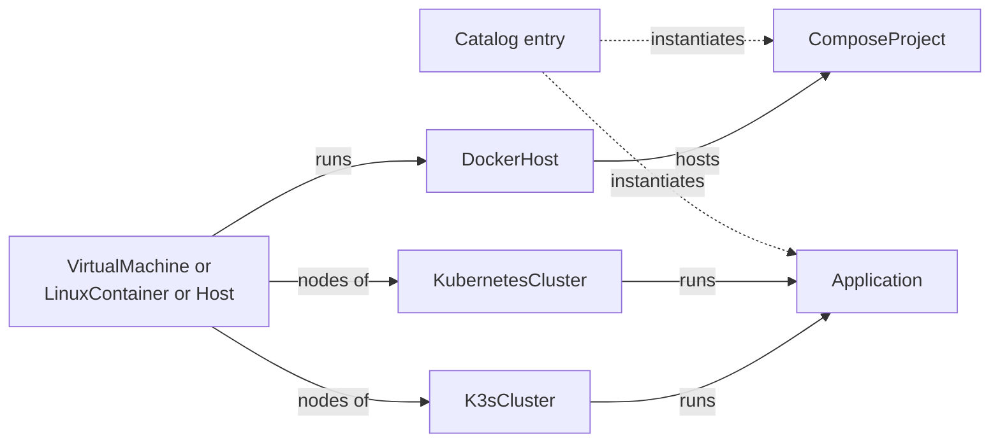

# 9. Containers and Kubernetes

> Part of the [nodr technical design](../README.md).

## 9.1 Scope and model



| Kind | Purpose |
| ---- | ------- |
| `DockerHost` | A host running Docker Engine, on a VM (default), an LXC container or an existing host |
| `ComposeProject` | A Docker Compose project on a Docker host |
| `K3sCluster` | A K3s cluster, from one node to an HA control plane with agents |
| `KubernetesCluster` | A cluster built with kubeadm (Kubespray), Talos or RKE2, or an existing cluster registered by kubeconfig |
| `Application` | A workload from a Helm chart, a Kustomize path, plain manifests or a catalog entry |

## 9.2 Docker hosts

- **Placement.** `DockerHost.spec.on` refers to a VM (the default, which nodr
  creates), an LXC container or an existing `Host`.
- **Engine installation.** The `nodr.platform.docker` Ansible role installs
  Docker Engine and the Compose plugin from Docker's official repository, on a
  pinned version channel.
- **Daemon defaults** in `daemon.json`:
  - log rotation (`max-size` 10 MB, `max-file` 3), because unbounded logs are
    the most common way Docker hosts fill their disks,
  - `live-restore` enabled, so containers survive engine restarts,
  - `default-address-pools` taken from an IPAM range that does not overlap any
    `Network`, which avoids the common clash between Docker's default
    `172.17.0.0/16`-style networks and existing LAN subnets,
  - registry mirrors and credentials, when configured.
- **LXC caveats.** Docker inside LXC needs the `nesting` feature (and `keyctl`
  for unprivileged containers), gives weaker isolation and is more fragile
  across host upgrades than a VM. nodr sets the features correctly, warns, and
  on ZFS-backed containers checks that the OpenZFS version supports overlayfs.
- **Rootless mode** is available as an option.
- **Maintenance.** Scheduled image pruning; engine updates follow the host's
  `UpdatePolicy`.

## 9.3 Compose projects

```yaml
apiVersion: nodr/v1alpha1
kind: ComposeProject
metadata:
  name: docs
spec:
  host: docker-01
  source:
    catalog: { app: paperless-ngx, version: "^2" }   # or: path: compose/docker-01/docs
  env:
    PAPERLESS_TIME_ZONE: Europe/Berlin
  secrets:
    PAPERLESS_DBPASS: docs/db-password               # secret reference
  images:
    updates: { allow: minor, window: sunday-early, autoApply: true }
  volumes:
    backup: { policy: nightly-7d4w, consistency: stop }   # stop | pause | hook
  expose:
    - { service: webserver, port: 8000, hostname: docs.home.arpa, via: reverse-proxy }
```

### Sources and ownership

- **Catalog sources** render `compose.yaml` as managed code. The lens maps
  catalog parameters to Compose values.
- **User sources** keep `compose.yaml` user-owned. nodr does not edit it.
  Everything nodr adds (labels, networks, image digest pins, reverse-proxy
  settings) goes into `compose.nodr.yaml`, and deployments pass both files.
  Compose merges multiple files natively, much like Terraform override files.
- **Environment and secrets.** `.env.template` in Git holds secret references.
  The executor renders `.env` on the host at deploy time with mode `0600`. It
  is never committed.
- **Image lock.** `images.lock` records the resolved digest of every image.
  Deployments always run digests, so a redeploy is reproducible.

### Deployment

- Over an SSH Docker context:
  `docker compose -p docs -f compose.yaml -f compose.nodr.yaml up -d --wait --remove-orphans`.
  `--wait` blocks until services are running or healthy.
- **Plan:** the normalized output of `docker compose config` compared with the
  running project (a configuration hash label on each container), plus image
  digest changes.
- **Rollback:** redeploy the previous revision's Compose files and image lock.

### Image updates

Instead of updating containers blindly, nodr treats image updates as
reviewable changes:

1. A scheduled check looks for new tags within the allowed semantic-version
   range (`patch`, `minor`, `major`) and for new digests of the current tag.
2. It creates a change set that bumps `images.lock`, and the tag if needed.
3. Depending on the policy, the change set waits for review or is applied
   automatically inside the maintenance window.
4. A health gate checks container health checks and optional HTTP probes.
   If it fails, the previous digests are redeployed automatically.

### Volume backups

For consistency, nodr stops or pauses the project, or runs an application
hook such as a database dump. It then backs up the volumes with the Proxmox
Backup client to PBS (file-level and deduplicated) or with restic to
S3-compatible storage, restarts the project and verifies it. Restores work per
project, to the same host or another one.

### Exposure

Services are exposed through a reverse proxy (Traefik or Caddy, configured
through labels in `compose.nodr.yaml`) or through a `PortForward`
([§8.7](08-networking.md#87-firewall-policy-and-exposure)). TLS comes from ACME
for public names, or from an internal certificate authority for `home.arpa`
names.

## 9.4 K3s clusters

```yaml
apiVersion: nodr/v1alpha1
kind: K3sCluster
metadata:
  name: k3s-home
spec:
  version: { channel: stable }          # or an exact version
  network: lab
  apiEndpoint: { vip: auto, provider: kube-vip }     # VIP allocated from IPAM
  servers:
    count: 3                            # 1, or an odd number for embedded etcd
    size: medium
    spreadAcross: pve-main              # one server per Proxmox node
  agents:
    count: 2
    size: large
  components:
    traefik: true
    serviceLB: false
    loadBalancer: { provider: metallb, pool: auto }  # address pool from IPAM
    storage: { default: longhorn }      # local-path | longhorn | proxmox-csi | ceph-rbd
  etcdSnapshots: { cron: "0 */6 * * *", retain: 12, offsite: pbs-main }
  policies:
    updates: k3s-monthly
  gitops: { enabled: true, tool: flux }
```

### Provisioning

The cross-engine flow is shown in [§5.6](05-compiler-and-engines.md#56-cross-engine-orchestration):
allocate addresses and the API VIP, create DHCP reservations and DNS records,
provision the VMs on separate Proxmox nodes, wait for readiness, apply the OS
baseline, install K3s on the servers and then the agents, store the
kubeconfig, deploy add-ons and register schedules.

The K3s configuration is rendered from intent through Ansible variables:

```yaml
# /etc/rancher/k3s/config.yaml on the first server
cluster-init: true
token-file: /etc/rancher/k3s/cluster-token     # written from the secrets service
tls-san:
  - 10.0.40.10                                 # API VIP
  - k3s-home.lab.home.arpa
disable:
  - servicelb
etcd-snapshot-schedule-cron: "0 */6 * * *"
etcd-snapshot-retention: 12
node-taint:
  - CriticalAddonsOnly=true:NoExecute
```

### Components

| Concern | Options | Default |
| ------- | ------- | ------- |
| API endpoint | kube-vip in ARP mode with a VIP from IPAM | kube-vip for HA clusters, the server address otherwise |
| Load balancers | ServiceLB, or MetalLB with an address pool from IPAM | MetalLB for HA clusters |
| Ingress | Bundled Traefik, or none | Traefik |
| Storage | local-path, Longhorn, the Proxmox CSI plugin, Ceph RBD CSI against the Proxmox Ceph cluster | local-path for single-node clusters, Longhorn otherwise, Ceph RBD when Proxmox Ceph is present |

### Node lifecycle

- **Scale out:** provision a VM, apply the baseline, join it as an agent.
- **Scale in:** cordon, drain, delete the node from Kubernetes, then retire the
  VM with the normal retention rules.
- **Replace a server:** the same steps, plus removal of its etcd member before
  a new server joins, so the etcd quorum stays healthy.

### Upgrades

Upgrades use the system-upgrade-controller, the upgrade mechanism native to
K3s. nodr manages two plans, servers first and then agents, each with
`concurrency: 1` and cordoning. nodr sets the plans' target version only when
the maintenance window opens, so the upgrade mechanics stay native while
timing stays under policy control:

```yaml
apiVersion: upgrade.cattle.io/v1
kind: Plan
metadata:
  name: k3s-server
  namespace: system-upgrade
spec:
  concurrency: 1
  cordon: true
  nodeSelector:
    matchExpressions:
      - { key: node-role.kubernetes.io/control-plane, operator: In, values: ["true"] }
  serviceAccountName: system-upgrade
  upgrade:
    image: rancher/k3s-upgrade
  version: v1.xx.y+k3s1       # written by nodr inside the window
```

### Backups and certificates

- **etcd snapshots** use K3s's own schedule. nodr copies them off the cluster
  to S3-compatible storage (natively supported by K3s) or to PBS. Velero or
  Longhorn backups cover persistent volume data.
- **Certificates.** K3s client and server certificates are valid for one
  year. K3s renews certificates that expire within 120 days whenever the
  service starts (90 days on releases before May 2025). Clusters that are
  upgraded regularly therefore renew silently. nodr tracks expiry and, if no
  restart happened, schedules a rolling restart in a maintenance window at
  least 30 days before expiry.
- **Kubeconfig.** The admin kubeconfig is stored in the secrets service.
  Users with permission can download it. OIDC-based per-user access can be
  enabled through K3s's API server arguments.

## 9.5 Kubernetes clusters

| Distribution | Install and lifecycle engine | Upgrades | Notes |
| ------------ | ---------------------------- | -------- | ----- |
| kubeadm | Ansible with Kubespray | Kubespray's upgrade playbook | For teams that want upstream Kubernetes |
| Talos Linux | OpenTofu with the `siderolabs/talos` provider, Talos images for the VMs | `talosctl` for OS and Kubernetes upgrades | Immutable, API-managed nodes, popular in homelabs |
| RKE2 | Ansible | system-upgrade-controller | Hardened distribution for SMEs with compliance needs |
| External | None | Not managed | Registered by kubeconfig; nodr manages applications only |

All distributions implement one lifecycle interface (create, scale, upgrade,
back up, rotate credentials, destroy), so the GUI, schedules and policies are
the same whatever the distribution. Operations a distribution does not support
are disabled in the GUI with an explanation.

## 9.6 Applications

```yaml
apiVersion: nodr/v1alpha1
kind: Application
metadata:
  name: home-assistant
spec:
  cluster: k3s-home
  namespace: home
  source:
    helm:
      repo: oci://registry.example.com/charts
      chart: home-assistant
      version: "^0.3"
  values:
    persistence: { size: 10Gi }
  delivery: gitops                      # gitops | direct
  expose:
    - { service: home-assistant, port: 8123, hostname: ha.home.arpa, via: ingress }
  policies:
    updates: apps-minor
```

- **Forms from charts.** When a chart ships `values.schema.json`, nodr renders
  a form from it, with top-level keys grouped. Otherwise the values are edited
  as YAML and validated with `helm template`.
- **Direct delivery.** nodr installs and upgrades with the Helm SDK or applies
  manifests with server-side apply as field manager `nodr`, and tracks health
  with kstatus conventions.
- **GitOps delivery.** nodr can bootstrap Flux, writes `HelmRelease` and
  `Kustomization` objects to `kubernetes/<cluster>/apps/<app>/`, and reads the
  Flux objects' conditions for status. Other GitOps controllers, such as
  Argo CD, can be added as plugins.
- **Integrations.** Load-balancer addresses come from IPAM (a MetalLB address
  pool rendered from the network's pool). DNS records for services and ingress
  hosts are created on OpenWrt. cert-manager issues certificates from ACME or
  an internal CA. Velero or Longhorn provides backups.
- **Rollback.** Helm rollback in direct mode; a Git revert in GitOps mode.

## 9.7 Catalog

- Each catalog entry contains metadata, a parameter schema with field tiers,
  one or both variants (Compose and Helm), default policies (backup, updates),
  exposure hints, sizing and health checks.
- Entries are versioned and signed. Community catalogs are Git repositories
  with signed releases and must be enabled explicitly.
- The beginner flow: pick an app, pick where it runs (a Docker host or a
  cluster), fill in the few `basic` parameters, and nodr creates the resources
  and attaches the default policies.

## 9.8 Portability between Docker and Kubernetes

- Catalog apps with both variants can move between a Docker host and a
  cluster through a guided workflow: deploy on the target, stop the source,
  copy volumes, switch DNS and exposure, verify, and retire the source with the
  usual retention period.
- Arbitrary Compose projects are not converted automatically, because
  conversion tools are lossy. nodr can generate a Helm chart skeleton as a
  starting point, marked as user-owned code, but does not manage such a
  migration.
