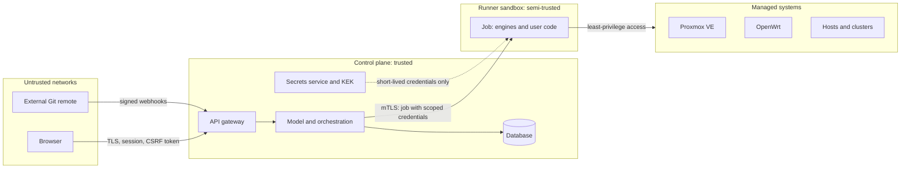

# 10. Security Architecture

> Part of the [nodr technical design](../README.md).

nodr holds root-equivalent access to hypervisors, routers and clusters.
Security is therefore part of the core design rather than a layer added
later.

## 10.1 Objectives

1. Protect the credentials that give access to infrastructure.
2. Let only authorized and, where required, reviewed changes reach
   infrastructure.
3. Contain the damage a compromised component can do, whether it is a user
   account, a runner or a plugin.
4. Keep a complete, tamper-evident audit trail.
5. Keep secrets out of Git, logs and engine state wherever possible.

## 10.2 Threat model

### Assets

| Asset | Why it matters |
| ----- | -------------- |
| Infrastructure credentials: Proxmox tokens, SSH keys and CA, OpenWrt logins, kubeconfigs | Direct control over all managed systems |
| Application secrets: passwords, Wi-Fi keys, WireGuard keys, PBS encryption keys | Data access; PBS keys are also needed to restore encrypted backups |
| Workspace repository | Changing desired state changes infrastructure |
| Engine state | Can contain sensitive values |
| Audit log | Accountability |
| nodr's key-encryption key (KEK) | Unlocks every stored secret |

### Trust boundaries



Runners are *semi-trusted*: they execute code that users with `code:write`
wrote, so they never hold long-lived credentials or the KEK.

### Threats and mitigations

| Threat | Example | Mitigations |
| ------ | ------- | ----------- |
| Credential theft from nodr | Stolen database backup | Envelope encryption with the KEK outside the database, short-lived credentials, least privilege on every target |
| Malicious code through Advanced Mode | A `local-exec` provisioner exfiltrates environment variables | `code:write` permission, approval rules, runner isolation, per-job credentials, policy rules that forbid risky constructs |
| Compromised runner | A remote runner at a branch office is stolen | Revocable mTLS identity, no long-lived credentials, jobs routed only to the runner's own site, audit |
| Malicious or vulnerable plugin | Supply-chain attack | Signature verification, digest pinning, WebAssembly sandbox for lenses, sandboxed executors, publisher allow-list |
| Tampering with desired state | A push to the external remote | Branch protection, sync validation, approvals before apply, optional commit signature verification |
| Browser attacks | Session hijacking, CSRF, XSS | HttpOnly SameSite cookies, CSRF tokens, strict CSP, no plugin JavaScript |
| Privilege escalation | An editor applies to production | Scoped role bindings, approvals, separation of duties |
| Secret leakage in output | Ansible prints a password | `no_log`, sensitive variables, masking of injected secret values, sanitized plans |
| Lateral movement | One SSH key opens every host | SSH certificates with short validity and per-host principals, host key pinning |
| Denial of service | API flooding | Rate limits, queue limits, per-workspace quotas |
| Repudiation | "I did not make that change" | Hash-chained audit log, Git authorship |

## 10.3 Identity and authentication

- **Local accounts:** Argon2id password hashes, TOTP and WebAuthn (passkeys),
  lockout with exponential backoff.
- **Single sign-on:** OpenID Connect with providers such as Authentik,
  Keycloak, Authelia, Microsoft Entra ID or Google. Group claims map to role
  bindings.
- **API tokens:** scoped to a workspace and a set of permissions, with an
  expiry date. They are shown once and stored as hashes. Service accounts own
  tokens used by automation.
- **Sessions:** `HttpOnly`, `Secure` and `SameSite=Strict` cookies, CSRF tokens
  on state-changing requests, idle and absolute timeouts.
- **Step-up authentication** for sensitive actions: revealing a secret,
  deleting protected resources, using break-glass access.
- **CLI:** OAuth device authorization flow.

## 10.4 Authorization

Permissions are fine-grained verbs, such as `intent:write`, `code:write`,
`changeset:apply`, `operation:console` and `secret:reveal`, grouped into
roles. Custom roles are supported.

| Role | Permissions |
| ---- | ----------- |
| **Viewer** | Read everything except secret values |
| **Operator** | Viewer, plus operations (start, stop, console, snapshot), starting workflows, acknowledging alerts. No desired-state changes. |
| **Editor** | Operator, plus intent changes through the GUI and API, creating change sets, applying outside protected environments |
| **Developer** | Editor, plus code changes (`code:write`), user-owned code and workflows with script steps |
| **Approver** | Approving change sets in scope |
| **Admin** | Everything, including credentials, users, plugins and runners |

A **role binding** combines a subject (user, group or token), a role and a
scope. Scopes are a workspace, an environment, a label selector or a set of
kinds.

**Enforcement points:**

- Commands are authorized against the scope of their target resource.
- Code edits are authorized per file. Managed files map to the resources they
  contain. User-owned files can affect anything, so they require `code:write`
  for the whole workspace.
- Applying a change set requires `changeset:apply` for every resource in it.
- Operations are authorized per target.

**Approval rules** are part of workspace settings:

```yaml
approvals:
  - match: { environment: prod }
    require: { approvers: 1, excludeAuthor: true }
  - match: { impact: [destroy, replace] }
    require: { approvers: 1, excludeAuthor: true, stepUpAuth: true }
  - match: { kinds: [FirewallPolicy, PortForward] }
    require: { approvers: 1, group: network-admins }
  - match: { userOwnedCode: true }
    require: { approvers: 1, excludeAuthor: true }
```

**Break-glass access:** a local emergency administrator that works without
the identity provider, requires strong authentication, raises an alert when
used and is fully audited.

## 10.5 Secrets management

- **Envelope encryption.** Each secret is encrypted with its own data key
  (AES-256-GCM). Data keys are wrapped by the KEK.
- **KEK sources:**
  - a key file or environment variable (default for the all-in-one
    appliance, protected by file permissions and disk encryption),
  - a passphrase stretched with Argon2id, entered at startup (manual unseal),
  - a key sealed to the host's TPM,
  - an external KMS such as the OpenBao or HashiCorp Vault transit engine.
- **Rotation.** Rotating the KEK re-wraps data keys without re-encrypting
  values. Credentials that nodr manages, such as Proxmox tokens, rpcd
  passwords and the SSH CA, are rotated by workflows.
- **References, not values.** Intent refers to secrets by name, and sensitive
  schema fields are marked `x-nodr-sensitive`. Values never enter Git, except
  as optional SOPS-encrypted files (age recipients) for portability and
  export.
- **External stores** through plugins: OpenBao and Vault KV, Infisical,
  Bitwarden Secrets Manager and 1Password Connect. Values are read at job
  time.
- **Delivery to engines.** Environment variables or files on a tmpfs inside
  the sandbox, removed after the job:
  - OpenTofu: sensitive variables, ephemeral values and write-only attributes
    on OpenTofu 1.11 and later, and state and plan encryption,
  - Ansible: an extra-vars file and `no_log`,
  - UCI: placeholders resolved at apply time,
  - Compose: `.env` rendered on the target with mode `0600`.
- **Masking.** The runner knows which values it injected and masks them in
  all logs and plan output, in addition to the engines' own sensitivity
  markers.
- **Revealing** a value requires `secret:reveal` and step-up authentication,
  and is audited.

## 10.6 Credentials for managed systems

| System | Credential | Hardening |
| ------ | ---------- | --------- |
| Proxmox VE | API token of a dedicated user and role, with privilege separation | Optional expiring tokens minted per run by a broker token |
| Proxmox Backup Server | API token limited to specific datastores and namespaces | Separate tokens for backup and administration |
| OpenWrt | Dedicated rpcd login with an ACL | SSH key used only for firmware operations |
| Linux hosts and guests | Dedicated `nodr` user with scoped `sudo` | SSH certificates from nodr's SSH CA, valid for 10 minutes, per-host principals; the baseline profile configures `TrustedUserCAKeys` |
| Docker hosts | SSH access to the Docker socket | Documented as root-equivalent; rootless mode available |
| Kubernetes | Service account with RBAC for day-to-day work, admin kubeconfig for lifecycle operations | Admin kubeconfig kept in the secrets service |

**Host keys** are trusted on first use after the user confirms the
fingerprint, then pinned in the inventory. A changed host key is an alert,
because it means either a rebuilt host or an attack.

## 10.7 Runner isolation and code execution

Advanced Mode code can execute arbitrary commands: OpenTofu provisioners and
the `external` data source, Ansible `shell` and `command`, Helm hooks, Compose
builds. nodr treats `code:write` as code execution and contains it:

- **Ephemeral sandboxes.** Each job runs in a fresh rootless container
  (Podman or Docker), or optionally a microVM, with a read-only root file
  system holding the pinned toolchain and a tmpfs working directory.
- **No path to the core.** A job cannot reach the database, the KEK or other
  jobs.
- **Scoped, short-lived credentials** for the job's targets only.
- **Optional egress allow-list** limited to the job's targets and configured
  mirrors.
- **Static policy checks.** An SME hardening rule pack rejects `local-exec` and
  `remote-exec` provisioners, the `external` data source, unpinned providers
  and similar constructs before a plan runs.
- **Language servers** for the editor run in the same kind of sandbox, with no
  credentials at all.

## 10.8 Supply chain

- **nodr releases** are reproducible builds, signed with Sigstore, with SPDX
  SBOMs and SLSA provenance attestations. Container images are signed.
- **Toolchain.** OpenTofu, providers, Ansible collections and Helm charts are
  pinned with checksums (`nodr.lock`, `.terraform.lock.hcl`,
  `requirements.yml`). Ansible collection signatures are verified where
  publishers provide them. Mirrors support air-gapped installations.
- **Plugins and catalogs** are signed, pinned by digest and limited to allowed
  publishers. Community catalogs are opt-in.
- **Self-updates** of nodr verify signatures before installing.

## 10.9 Audit

- **Events:** authentication, denied requests, commands, change-set lifecycle
  (created, approved, applied), operations, workflow runs, secret reveals,
  credential changes, plugin and runner changes, break-glass use.
- **Each record** holds who (user, token or schedule), what (action, targets,
  diff reference), when, where (IP address, user agent, runner), why (the
  reason field) and the outcome.
- **Tamper evidence.** Records are append-only and hash-chained: each record
  includes the hash of the previous one. The chain head is exported
  periodically so that truncation is detectable.
- **Export** to syslog, OpenTelemetry logs or webhooks. The default retention
  is one year.
- **Git history** is an independent second record of every desired-state
  change.

## 10.10 Platform hardening

- **TLS** through ACME, or a self-signed certificate whose fingerprint is
  shown at setup. HSTS, TLS 1.2 or later, TLS 1.3 preferred.
- **Web headers:** a strict Content Security Policy without inline scripts,
  `frame-ancestors` limited to the console origin, `X-Content-Type-Options`
  and a restrictive `Referrer-Policy`.
- **Rate limiting** and brute-force protection on authentication endpoints.
- **Runner enrollment** with one-time tokens, mTLS client certificates that
  rotate automatically, and a revocation list. The control plane never accepts
  connections initiated by managed systems.
- **Secure defaults:** protection flags on, approvals on for `prod` in the SME
  template, telemetry off unless the user opts in.
- **Data at rest:** secrets are encrypted by the application, disk encryption
  is recommended, and backups of nodr are encrypted.

## 10.11 Secret scanning

Saves in Advanced Mode and pushes to the nodr Git endpoint are scanned for
plaintext secrets: known credential formats, high-entropy strings in
suspicious keys and values that match stored secrets. A finding blocks the
commit and offers a one-click fix that moves the value into the secrets
service and replaces it with a reference.
